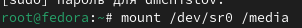

---
## Front matter
lang: ru-RU
title: Лабораторная работа №1
subtitle: Операционные системы
author:
  - Чистов Д. М.
institute:
  - Российский университет дружбы народов, Москва, Россия
date: 02 Марта 2004

## i18n babel
babel-lang: russian
babel-otherlangs: english

## Formatting pdf
toc: false
toc-title: Содержание
slide_level: 2
aspectratio: 169
section-titles: true
theme: metropolis
header-includes:
 - \metroset{progressbar=frametitle,sectionpage=progressbar,numbering=fraction}
 - '\makeatletter'
 - '\beamer@ignorenonframefalse'
 - '\makeatother'

## Fonts
mainfont: Liberation Serif
romanfont: Liberation Serif
sansfont: Liberation Serif
monofont: Liberation Serif
mainfontoptions: Ligatures=TeX
romanfontoptions: Ligatures=TeX
---

# Вступительная информация

## Цель работы

Целью данной работы является приобретение практических навыков установки операционной системы на виртуальную машину, настройки минимально необходимых для дальнейшей работы сервисов.

## Задание

1. Создание виртуальной машины
2. Установка Операционной Системы
3. После установки
4. Установка программного обеспечения
5. Дополнительные задания

# Выполнение лабораторной работы

## 1. Создание виртуальной машины

Открываю программу VirtualBox и нажимаю кнопку "Создать".

{#fig:001 width=70%}

## 1. Создание виртуальной машины

В всплывающем окне задаю имя виртуальной машины, путь, где она будет находиться, а также ISO-образ операционной системы Fedora.

{#fig:002 width=70%}

## 1. Создание виртуальной машины

Задаю кол-во выделенной оперативной памяти и ядер процессора хостовой машины для виртуальной машины.

{#fig:003 width=70%}

## 1. Создание виртуальной машины

Выделяю 80гб места своего жёсткого диска для виртуальной машины.

{#fig:004 width=70%}

## 1. Создание виртуальной машины

На финальном экране проверяю корректность характеристик машины.

{#fig:006 width=70%}

## 1. Создание виртуальной машины

Виртуальная машина успешно создана.

{#fig:007 width=70%}

## 2. Установка Операционной Системы

Запускаю виртуальную машину. Пока она будет запущена через образ ISO, который в будущем нужно будет отключить. Меня приветствует окно начала установки. Начинаем!

## 2. Установка Операционной Системы

Выбираю язык раскладки клавиатуры - русский и английский.

{#fig:008 width=70%}

## 2. Установка Операционной Системы

Выбираю часовой пояс, который предоставит корректные для меня дату и время.

{#fig:009 width=70%}

## 2. Установка Операционной Системы

Выбираю нужный жётский диск, на который будет установлена ОС.

{#fig:010 width=70%}

## 2. Установка Операционной Системы

После всех конфигураций начинаю установку.

{#fig:011 width=70%}

## 2. Установка Операционной Системы

Установка прошла успешно.

{#fig:012 width=70%}

## 2. Установка Операционной Системы

Теперь важный шаг. Открываю VirtualBox и ищу образ ISO.

{#fig:013 width=70%}

## 2. Установка Операционной Системы

Нажимаю на него правой кнопкой мыши и отключаю от виртуальной машины.

{#fig:014 width=70%}

## 2. Установка Операционной Системы

После этого перезапускаю виртуальную машину и наблюдаю, что ОС была установлена успешно.

{#fig:015 width=70%}

## 2. Установка Операционной Системы

Перехожу к настройке ОС. Создаю нового пользователя - ввожу своё имя и логин в соответствии с требованиями.

{#fig:016 width=70%}

## 2. Установка Операционной Системы

Задаю пароль новому пользователю.

{#fig:017 width=70%}

# 3. После установки

## Обновление пакетов

Открываю терминал, захожу в режим супер-пользователя и обновляю все пакеты.

{#fig:018 width=70%}

## Повышение комфорта работы

Устанавливаю программу для удобства работы в консоли - tmux.

{#fig:020 width=120%}

## Автоматическое обновление

Устанавливаю ПО для автоматического обновления.

{#fig:022 width=70%}

## Автоматическое обновление

Устанавливаю таймер.

{#fig:023 width=70%}

## Отключение SELinux

По заданию требуют отключить SELinux, для начала нужно открыть Midnight Commander.

{#fig:024 width=70%}

## Отключение SELinux

Перемещаюсь в папку /etc/selinux и нахожу файл config.

{#fig:025 width=70%}

## Отключение SELinux

Открываю его с помощью утилиты mcedit и заменяю параметр SELINUX с "enforcing" на "permissive".

{#fig:026 width=70%}

## Отключение SELinux

{#fig:027 width=70%}

## Отключение SELinux

После этого перезагружаю виртуальную машину.

{#fig:028 width=70%}

## Устаовка драйверов VirtualBox

Открываю консоль перехожу в роль супер-пользователя с утилитой tmux и начинаю установку Developer Tools.

{#fig:029 width=70%}

## Устаовка драйверов VirtualBox

После этого успешно устанавливаю пакет DKMS.

{#fig:030 width=70%}

## Устаовка драйверов VirtualBox

Монтирую образ диска дополнений гостевой ОС, а затем подмонтирую его.

{#fig:031 width=70%}

## Устаовка драйверов VirtualBox

Устанавливаю драйвера и перезагружаю виртульную машину.

{#fig:032 width=70%}

## Настройка раскладки клавиатуры

Открываю терминал, перехожу в роль супер-пользователя и редактирую файл /etc/X11/xorg.conf.d/00-keyboard.conf.

{#fig:034 width=120%}

## Настройка раскладки клавиатуры

{#fig:035 width=70%}

## Настройка раскладки клавиатуры

Перезагружаю виртульную машину.

{#fig:036 width=70%}

## Подключение общей папки

Внутри виртуальной машины добавляю своего пользователя в группу vboxsf.

{#fig:037 width=70%}

## Подключение общей папки

Внутри своего компьюетра (ОС Windows 11), создаю общую папку в удобном месте, открываю консоль выбираю диск, на котором лежит общая папка, вспоминаю путь до общей папки и её название, их вписываю в особую комманду в консоли Windows.

{#fig:038 width=120%}

## Подключение общей папки

Общая папка успешно установлена. Видно, что файл лежит внутри папки в Windows и такой же файл лежит в папке внутри виртуальной машины.

{#fig:039 width=120%}

## Подключение общей папки

{#fig:040 width=120%}

## 4. Установка программного обеспечения

Устанавливаю pandoc.

{#fig:041 width=70%}

## 4. Установка программного обеспечения

Устанавливаю дополнения для pandoc, а pandoc crossref, скачиваю с github, распаковываю и помещаю в папку usr/local/bin.

{#fig:043 width=100%}

## 4. Установка программного обеспечения

Устанавливаю TexLive.

{#fig:044 width=70%}

## 5. Дополнительные задания

С помощью grep получаю информацию о версии ядра.

{#fig:046 width=120%}

## 5. Дополнительные задания

Также получаю информацию о частоте процессора, его модели, об объёме доступной памяти, о типе обнаруженного гипервизора, типе файловой системы корневого раздела, о последовательности монтирования файловых систем.

## 5. Дополнительные задания

{#fig:047 width=120%}

## 5. Дополнительные задания

{#fig:048 width=120%}

## 5. Дополнительные задания

{#fig:049 width=120%}

## 5. Дополнительные задания

{#fig:050 width=120%}

## 5. Дополнительные задания

{#fig:051 width=120%}

## 5. Дополнительные задания

{#fig:052 width=120%}

# Выводы

Выполняя данную лабораторную работы я приобрёл навыки установки операционной системы на виртуальную машину, настройки минимально необходимых для дальнейшей работы сервисов.

# Список литературы{.unnumbered}

[Лабораторная работы №1](https://esystem.rudn.ru/mod/page/view.php?id=1098787)
