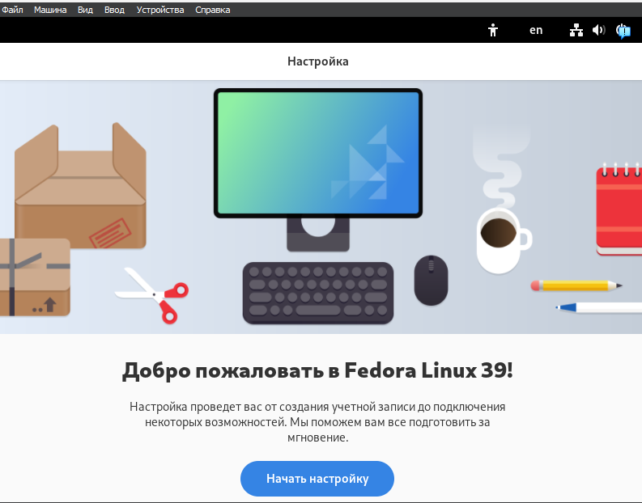
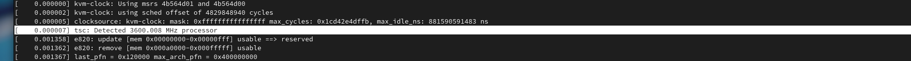

---
## Front matter
title: "Отчёт по лабораторной работе №1"
subtitle: "Операционные системы"
author: "Чистов Даниил Максимович"

## Generic otions
lang: ru-RU
toc-title: "Содержание"

## Bibliography
bibliography: bib/cite.bib
csl: pandoc/csl/gost-r-7-0-5-2008-numeric.csl

## Pdf output format
toc: true # Table of contents
toc-depth: 2
lof: true # List of figures
lot: false # List of tables
fontsize: 12pt
linestretch: 1.5
papersize: a4
documentclass: scrreprt
## I18n polyglossia
polyglossia-lang:
  name: russian
  options:
	- spelling=modern
	- babelshorthands=true
polyglossia-otherlangs:
  name: english
## I18n babel
babel-lang: russian
babel-otherlangs: english
## Fonts
mainfont: Liberation Serif
romanfont: Liberation Serif
sansfont: Liberation Serif
monofont: Liberation Serif
mainfontoptions: Ligatures=TeX
romanfontoptions: Ligatures=TeX
sansfontoptions: Ligatures=TeX,Scale=MatchLowercase
monofontoptions: Scale=MatchLowercase,Scale=0.9
## Biblatex
biblatex: true
biblio-style: "gost-numeric"
biblatexoptions:
  - parentracker=true
  - backend=biber
  - hyperref=auto
  - language=auto
  - autolang=other*
  - citestyle=gost-numeric
## Pandoc-crossref LaTeX customization
figureTitle: "Рис."
tableTitle: "Таблица"
listingTitle: "Листинг"
lofTitle: "Список иллюстраций"
lotTitle: "Список таблиц"
lolTitle: "Листинги"
## Misc options
indent: true
header-includes:
  - \usepackage{indentfirst}
  - \usepackage{float} # keep figures where there are in the text
  - \floatplacement{figure}{H} # keep figures where there are in the text
---

# Цель работы

Целью данной работы является приобретение практических навыков установки операционной системы на виртуальную машину, настройки минимально необходимых для дальнейшей работы сервисов.

# Задание

1. Создание виртуальной машины
2. Установка Операционной Системы
3. После установки
4. Установка программного обеспечения
5. Дополнительные задания

# Выполнение лабораторной работы

## 1. Создание виртуальной машины

Открываю программу VirtualBox и нажимаю кнопку "Создать" (рис. [-@fig:001]).

{#fig:001 width=70%}

В всплывающем окне задаю имя виртуальной машины, путь, где она будет находиться, а также ISO-образ операционной системы Fedora (рис. [-@fig:002]).

{#fig:002 width=70%}

Задаю кол-во выделенной оперативной памяти и ядер процессора хостовой машины для виртуальной машины (рис. [-@fig:003]).

{#fig:003 width=70%}

Выделяю 80гб места своего жёсткого диска для виртуальной машины (рис. [-@fig:004]).

{#fig:004 width=70%}

На финальном экране проверяю корректность характеристик машины (рис. [-@fig:006]).

{#fig:006 width=70%}

Виртуальная машина успешно создана (рис. [-@fig:007]).

{#fig:007 width=70%}

## 2. Установка Операционной Системы

Запускаю виртуальную машину. Пока она будет запущена через образ ISO, который в будущем нужно будет отключить. Меня приветствует окно начала установки. Начинаем!

Выбираю язык раскладки клавиатуры - русский и английский (рис. [-@fig:008]).

{#fig:008 width=70%}

Выбираю часовой пояс, который предоставит корректные для меня дату и время (рис. [-@fig:009]).

{#fig:009 width=70%}

Выбираю нужный жётский диск, на который будет установлена ОС (рис. [-@fig:010]).

{#fig:010 width=70%}

После всех конфигураций начинаю установку (рис. [-@fig:011]).

{#fig:011 width=70%}

Установка прошла успешно (рис. [-@fig:012]).

{#fig:012 width=70%}

Теперь важный шаг. Открываю VirtualBox и ищу образ ISO. (рис. [-@fig:013]).

{#fig:013 width=70%}

Нажимаю на него правой кнопкой мыши и отключаю от виртуальной машины (рис. [-@fig:014]).

{#fig:014 width=70%}

После этого перезапускаю виртуальную машину и наблюдаю, что ОС была установлена успешно (рис. [-@fig:015]).

{#fig:015 width=70%}

Перехожу к настройке ОС. Создаю нового пользователя - ввожу своё имя и логин в соответствии с требованиями (рис. [-@fig:016]).

{#fig:016 width=70%}

Задаю пароль новому пользователю (рис. [-@fig:017]).

{#fig:017 width=70%}

## 3. После установки

### Обновление пакетов

Открываю терминал, захожу в режим супер-пользователя и обновляю все пакеты (рис. [-@fig:018]).

{#fig:018 width=70%}

{#fig:019 width=70%}

### Повышение комфорта работы

Устанавливаю программу для удобства работы в консоли - tmux (рис. [-@fig:020]).

{#fig:020 width=70%}

{#fig:021 width=70%}

### Автоматическое обновление

Устанавливаю ПО для автоматического обновления (рис. [-@fig:022]).

{#fig:022 width=70%}

Устанавливаю таймер (рис. [-@fig:023]).

{#fig:023 width=70%}

### Отключение SELinux

По заданию требуют отключить SELinux, для начала нужно открыть Midnight Commander (рис. [-@fig:024]).

{#fig:024 width=70%}

Перемещаюсь в папку /etc/selinux и нахожу файл config (рис. [-@fig:025]).

{#fig:025 width=70%}

Открываю его с помощью утилиты mcedit (рис. [-@fig:026]), и заменяю параметр SELINUX с "enforcing" на "permissive" (рис. [-@fig:027]).

{#fig:026 width=70%}

{#fig:027 width=70%}

После этого перезагружаю виртуальную машину (рис. [-@fig:028]).

{#fig:028 width=70%}

### Устаовка драйверов VirtualBox

Открываю консоль перехожу в роль супер-пользователя с утилитой tmux и начинаю установку Developer Tools (рис. [-@fig:029]).

{#fig:029 width=70%}

После этого успешно устанавливаю пакет DKMS (рис. [-@fig:030]).

{#fig:030 width=70%}

Монтирую образ диска дополнений гостевой ОС, а затем подмонтирую его (рис. [-@fig:031]).

{#fig:031 width=70%}

Устанавливаю драйвера и перезагружаю виртульную машину (рис. [-@fig:032]).

{#fig:032 width=70%}

### Настройка раскладки клавиатуры

Открываю терминал, перехожу в роль супер-пользователя и редактирую файл /etc/X11/xorg.conf.d/00-keyboard.conf (рис. [-@fig:034]).

{#fig:034 width=70%}

{#fig:035 width=70%}

Перезагружаю виртульную машину (рис. [-@fig:036]).

{#fig:036 width=70%}

### Подключение общей папки

Внутри виртуальной машины добавляю своего пользователя в группу vboxsf (рис. [-@fig:037]).

{#fig:037 width=70%}

Внутри своего компьюетра (ОС Windows 11), создаю общую папку в удобном месте, открываю консоль выбираю диск, на котором лежит общая папка, вспоминаю путь до общей папки и её название, их вписываю в особую комманду в консоли Windows (рис. [-@fig:038]).

{#fig:038 width=70%}

Общая папка успешно установлена. На (рис. [-@fig:039]) видно, что файл лежит внутри папки в Windows, а на (рис. [-@fig:040]) видно, что такой же файл лежит в папке внутри виртуальной машины.

{#fig:039 width=70%}

{#fig:040 width=70%}

## 4. Установка программного обеспечения

Устанавливаю pandoc (рис. [-@fig:041]).

{#fig:041 width=70%}

{#fig:042 width=70%}

Устанавливаю дополнения для pandoc, а pandoc crossref, скачиваю с github, распаковываю и помещаю в папку usr/local/bin (рис. [-@fig:043]).

{#fig:043 width=70%}

Устанавливаю TexLive (рис. [-@fig:044]).

{#fig:044 width=70%}

{#fig:045 width=70%}

## 5. Дополнительные задания

С помощью grep получаю информацию о версии ядра (рис. [-@fig:046]).

{#fig:046 width=70%}

Также получаю информацию о частоте процессора (рис. [-@fig:047]), его модели (рис. [-@fig:048]), об объёме доступной памяти (рис. [-@fig:049]), о типе обнаруженного гипервизора (рис. [-@fig:050]), типе файловой системы корневого раздела (рис. [-@fig:051]), о последовательности монтирования файловых систем (рис. [-@fig:052]).

{#fig:047 width=70%}

{#fig:048 width=70%}

{#fig:049 width=70%}

{#fig:050 width=70%}

{#fig:051 width=70%}

{#fig:052 width=70%}

# Выводы

Выполняя данную лабораторную работы я приобрёл навыки установки операционной системы на виртуальную машину, настройки минимально необходимых для дальнейшей работы сервисов.

# Список литературы{.unnumbered}

[Лабораторная работы №1](https://esystem.rudn.ru/mod/page/view.php?id=1098787)
