---
## Front matter
lang: ru-RU
title: Лабораторная работа №2
subtitle: Операционные системы
author:
  - Чистов Д. М.
institute:
  - Российский университет дружбы народов, Москва, Россия
date: 02 Марта 2004

## i18n babel
babel-lang: russian
babel-otherlangs: english

## Formatting pdf
toc: false
toc-title: Содержание
slide_level: 2
aspectratio: 169
section-titles: true
theme: metropolis
header-includes:
 - \metroset{progressbar=frametitle,sectionpage=progressbar,numbering=fraction}
 - '\makeatletter'
 - '\beamer@ignorenonframefalse'
 - '\makeatother'

## Fonts
mainfont: Liberation Serif
romanfont: Liberation Serif
sansfont: Liberation Serif
monofont: Liberation Serif
mainfontoptions: Ligatures=TeX
romanfontoptions: Ligatures=TeX
---

# Вступительная информация

## Цель работы

Целью данной работы является изучить идеологию и применение средств контроля версий и освоить умения по работе с git.

## Задание

1. Создать базовую конфигурацию для работы с git.
2. Создать ключ SSH.
3. Создать ключ PGP.
4. Настроить подписи git.
5. Создать локальный каталог для выполнения заданий по предмету.

# Выполнение лабораторной работы

## 1. Создать базовую конфигурацию для работы с git.

Git и gh у меня уже были установлены заранее, поэтому переходим к настройке. Задаю имя и email владельца репозитория.

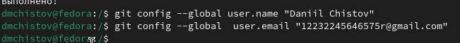{#fig:001 width=70%}

## 1. Создать базовую конфигурацию для работы с git.

Настраиваю utf-8 в выводе сообщений git.

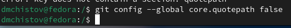{#fig:002 width=70%}

## 1. Создать базовую конфигурацию для работы с git.

Задаю имя начальной ветки (master).

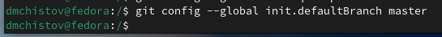{#fig:003 width=70%}

## 1. Создать базовую конфигурацию для работы с git.

Задаю параметр autocrlf и параметр safecrlf.

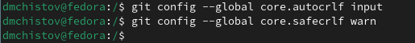{#fig:004 width=70%}

## 2. Создать ключ SSH.

Создаю ключ по алгоритму rsa с ключём размером 4096 бит.

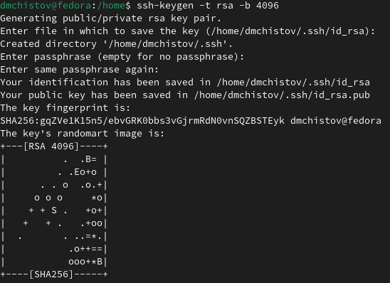{#fig:005 width=70%}

## 2. Создать ключ SSH.

Похожим образом создаю ключ по алгоритму ed25519.

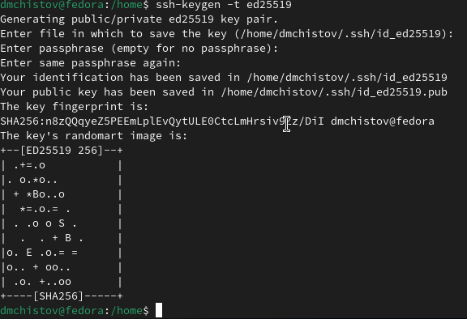{#fig:006 width=70%}

## 3. Создать ключ PGP.

Теперь от меня требуется создать ключ PGP. Ввожу команду gpg --full-generate-key. После чего мне задают несколько вопрос, на которые я отвечаю, как на .

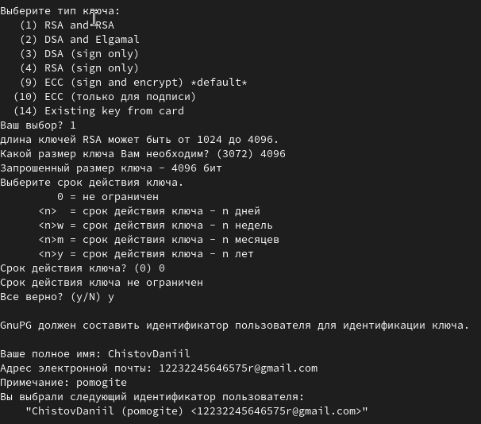{#fig:007 width=70%}

## 3. Создать ключ PGP.

От меня требуется задать особый пароль.

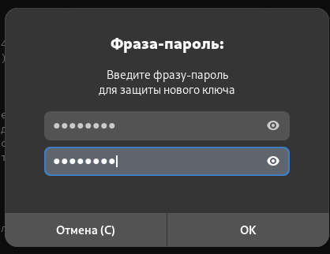{#fig:008 width=70%}

## 3. Создать ключ PGP.

Ключ успешно создан, нужно его добавить в Github. Вывожу список ключей.

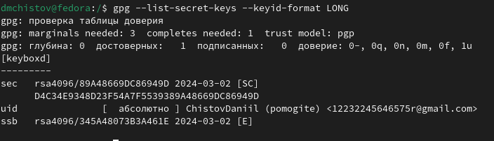{#fig:009 width=70%}

## 3. Создать ключ PGP.

Теперь мне нужно скопировать отпечаток ключа (набор символов после /) и вставить его в команду "gpg --armor --export <PGP Fingerprint> | xclip -sel clip".

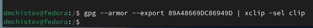{#fig:010 width=70%}

## 3. Создать ключ PGP.

Таким образом я скопировал pgp-ключ, теперь его требуется вставить на сайте GIthub. На нём у меня уже заведён профиль.

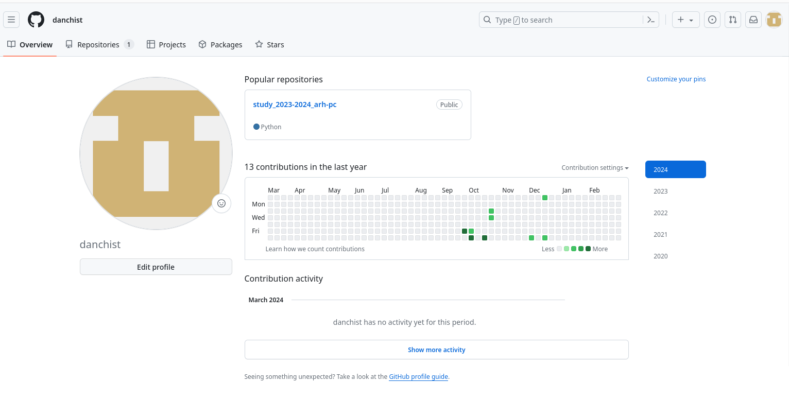{#fig:011 width=70%}

## 3. Создать ключ PGP.

Перехожу в раздел ключей, нажимаю "новый PGP ключ" и вставляю скопированный мною ранее ключ pgp.

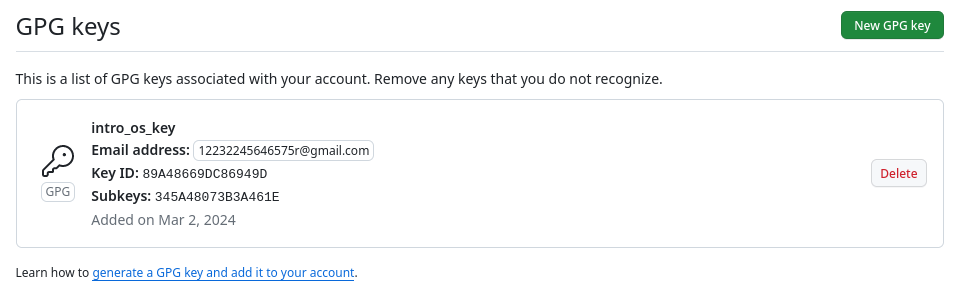{#fig:012 width=70%}

## 4. Настроить подписи git.

Копирую заново "отпечаток-ключа", а затем используя введёный email, указываю Git применять этот email при подписи коммитов, благодаря следующим командам.

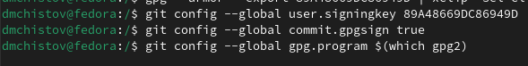{#fig:013 width=70%}

## 5. Создать локальный каталог для выполнения заданий по предмету.

Первым делом, авторизуюсь, мне задают различного рода вопросы.

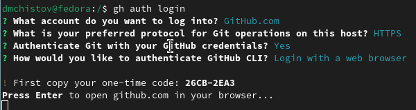{#fig:014 width=70%}

## 5. Создать локальный каталог для выполнения заданий по предмету.

Далее, мне позволят авторизироваться через браузер.

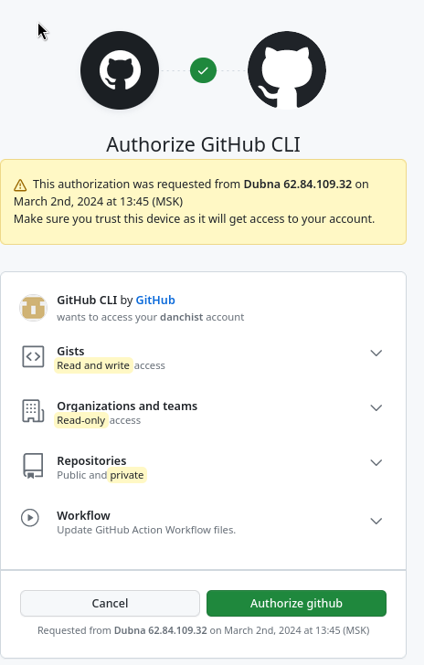{#fig:015 width=70%}

## 5. Создать локальный каталог для выполнения заданий по предмету.

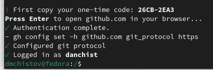{#fig:016 width=70%}

## 5. Создать локальный каталог для выполнения заданий по предмету.

Создаю необходимые папки в домашнем каталоге, перехожу в самую дальнюю, а затем создаю репозиторий.

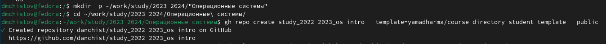{#fig:017 width=120%}

## 5. Создать локальный каталог для выполнения заданий по предмету.

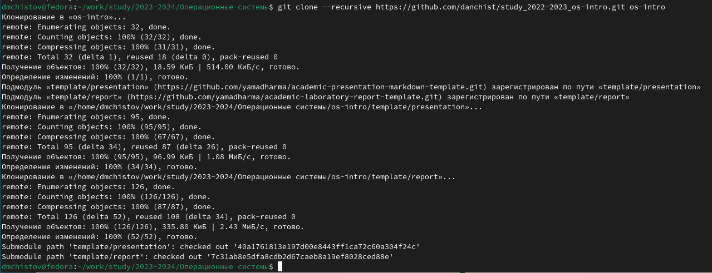{#fig:018 width=120%}

## 5. Создать локальный каталог для выполнения заданий по предмету.

Проверяю корректность клонирования.

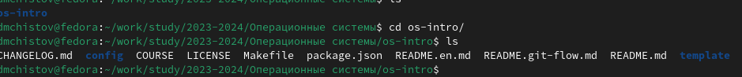{#fig:019 width=120%}

## 5. Создать локальный каталог для выполнения заданий по предмету.

Удаляю ненужные файлы и создаю нужные файлы.

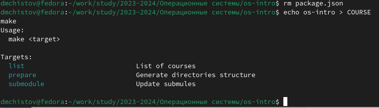{#fig:020 width=70%}

## 5. Создать локальный каталог для выполнения заданий по предмету.

Отправляю файлы на сервер.

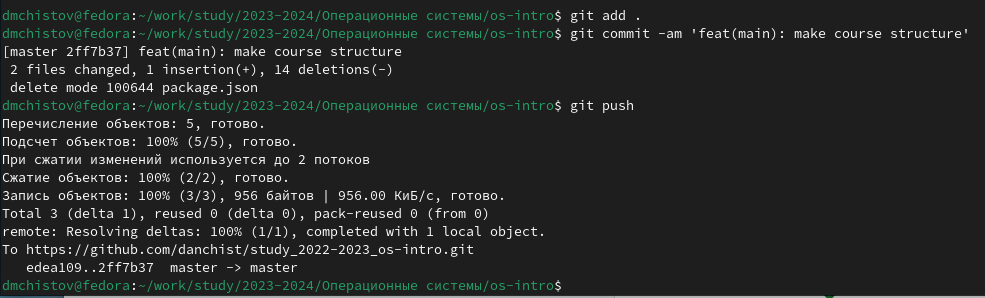{#fig:021 width=120%}

# Выводы

Выполняя данную работу я смог изучить идеологию и применение средств контроля версий и освоить умения по работе с git.

# Список литературы{.unnumbered}

[Лабораторная работы №2](https://esystem.rudn.ru/mod/page/view.php?id=1098790)
