---
## Front matter
title: "Отчёт по лабораторной работе №2"
subtitle: "Операционные системы"
author: "Чистов Даниил Максимович"

## Generic otions
lang: ru-RU
toc-title: "Содержание"

## Bibliography
bibliography: bib/cite.bib
csl: pandoc/csl/gost-r-7-0-5-2008-numeric.csl

## Pdf output format
toc: true # Table of contents
toc-depth: 2
lof: true # List of figures
lot: false # List of tables
fontsize: 12pt
linestretch: 1.5
papersize: a4
documentclass: scrreprt
## I18n polyglossia
polyglossia-lang:
  name: russian
  options:
	- spelling=modern
	- babelshorthands=true
polyglossia-otherlangs:
  name: english
## I18n babel
babel-lang: russian
babel-otherlangs: english
## Fonts
mainfont: Liberation Serif
romanfont: Liberation Serif
sansfont: Liberation Serif
monofont: Liberation Serif
mainfontoptions: Ligatures=TeX
romanfontoptions: Ligatures=TeX
sansfontoptions: Ligatures=TeX,Scale=MatchLowercase
monofontoptions: Scale=MatchLowercase,Scale=0.9
## Biblatex
biblatex: true
biblio-style: "gost-numeric"
biblatexoptions:
  - parentracker=true
  - backend=biber
  - hyperref=auto
  - language=auto
  - autolang=other*
  - citestyle=gost-numeric
## Pandoc-crossref LaTeX customization
figureTitle: "Рис."
tableTitle: "Таблица"
listingTitle: "Листинг"
lofTitle: "Список иллюстраций"
lotTitle: "Список таблиц"
lolTitle: "Листинги"
## Misc options
indent: true
header-includes:
  - \usepackage{indentfirst}
  - \usepackage{float} # keep figures where there are in the text
  - \floatplacement{figure}{H} # keep figures where there are in the text
---

# Цель работы

Целью данной работы является изучить идеологию и применение средств контроля версий и освоить умения по работе с git.

# Задание

1. Создать базовую конфигурацию для работы с git.
2. Создать ключ SSH.
3. Создать ключ PGP.
4. Настроить подписи git.
5. Создать локальный каталог для выполнения заданий по предмету.

# Выполнение лабораторной работы

## 1. Создать базовую конфигурацию для работы с git.

Git и gh у меня уже были установлены заранее, поэтому переходим к настройке. Задаю имя и email владельца репозитория (рис. [-@fig:001]).

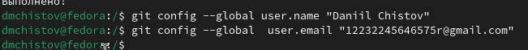{#fig:001 width=70%}

Настраиваю utf-8 в выводе сообщений git (рис. [-@fig:002]).

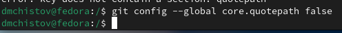{#fig:002 width=70%}

Задаю имя начальной ветки (master) (рис. [-@fig:003]).

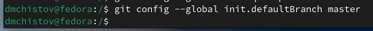{#fig:003 width=70%}

Задаю параметр autocrlf и параметр safecrlf (рис. [-@fig:004]).

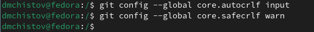{#fig:004 width=70%}

## 2. Создать ключ SSH.

Создаю ключ по алгоритму rsa с ключём размером 4096 бит (рис. [-@fig:005]).

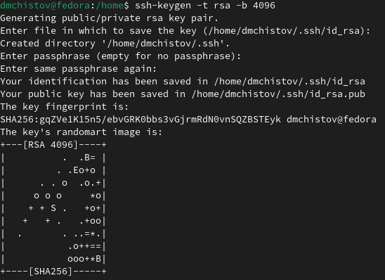{#fig:005 width=70%}

Похожим образом создаю ключ по алгоритму ed25519 (рис. [-@fig:006]).

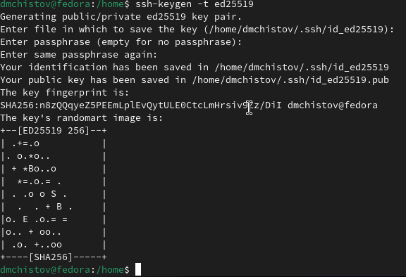{#fig:006 width=70%}

## 3. Создать ключ PGP.

Теперь от меня требуется создать ключ PGP. Ввожу команду gpg --full-generate-key. После чего мне задают несколько вопрос, на которые я отвечаю, как на (рис. [-@fig:007]).

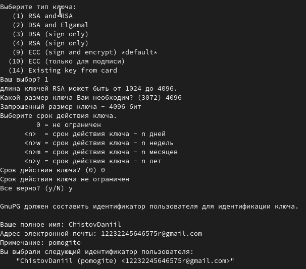{#fig:007 width=70%}

От меня требуется задать особый пароль (рис. [-@fig:008]).

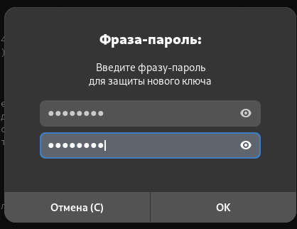{#fig:008 width=70%}

Ключ успешно создан, нужно его добавить в Github. Вывожу список ключей (рис. [-@fig:009]).

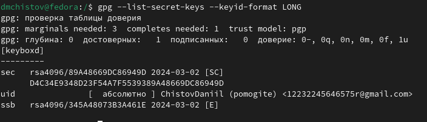{#fig:009 width=70%}

Теперь мне нужно скопировать отпечаток ключа (набор символов после /) и вставить его в команду "gpg --armor --export <PGP Fingerprint> | xclip -sel clip" (рис. [-@fig:010]).

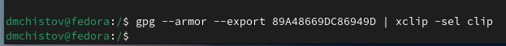{#fig:010 width=70%}

Таким образом я скопировал pgp-ключ, теперь его требуется вставить на сайте GIthub. На нём у меня уже заведён профиль (рис. [-@fig:011]).

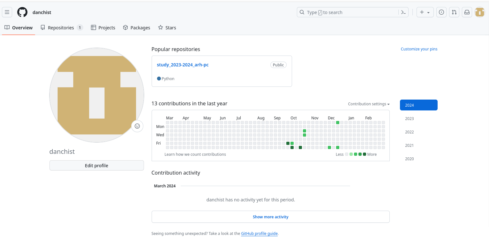{#fig:011 width=70%}

Перехожу в раздел ключей, нажимаю "новый PGP ключ" и вставляю скопированный мною ранее ключ pgp (рис. [-@fig:012]).

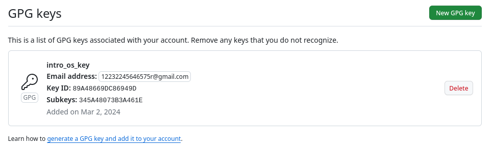{#fig:012 width=70%}

## 4. Настроить подписи git.

Копирую заново "отпечаток-ключа", а затем используя введёный email, указываю Git применять этот email при подписи коммитов, благодаря следующим командам (рис. [-@fig:013]).

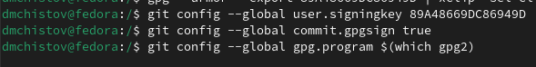{#fig:013 width=70%}

## 5. Создать локальный каталог для выполнения заданий по предмету.

Первым делом, авторизуюсь, мне задают различного рода вопросы (рис. [-@fig:014]).

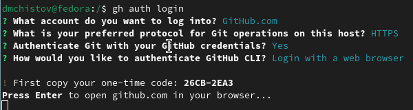{#fig:014 width=70%}

Далее, мне позволят авторизироваться через браузер (рис. [-@fig:015]).

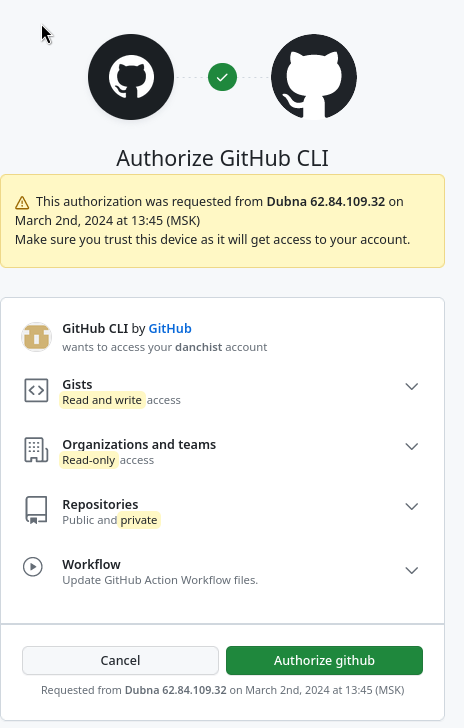{#fig:015 width=70%}

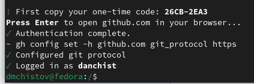{#fig:016 width=70%}

Создаю необходимые папки в домашнем каталоге, перехожу в самую дальнюю (рис. [-@fig:017]), а затем создаю репозиторий  (рис. [-@fig:018]).

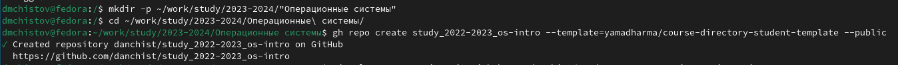{#fig:017 width=70%}

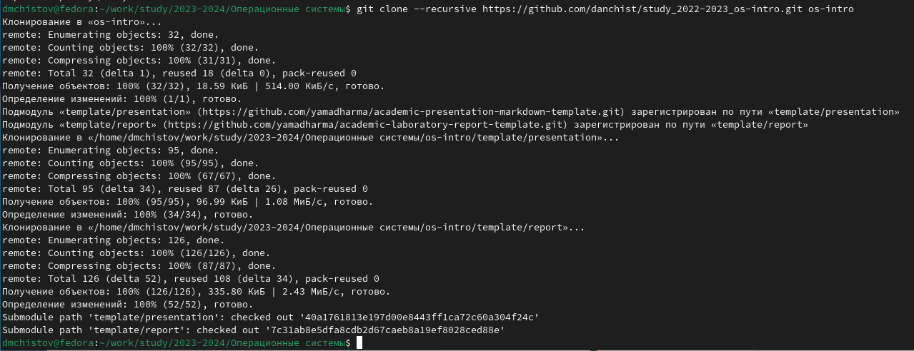{#fig:018 width=70%}

Проверяю корректность клонирования (рис. [-@fig:019]).

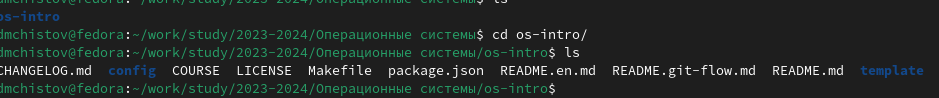{#fig:019 width=70%}

Удаляю ненужные файлы и создаю нужные файлы (рис. [-@fig:020]).

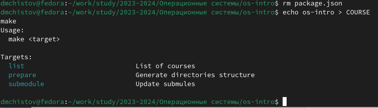{#fig:020 width=70%}

Отправляю файлы на сервер (рис. [-@fig:021]).

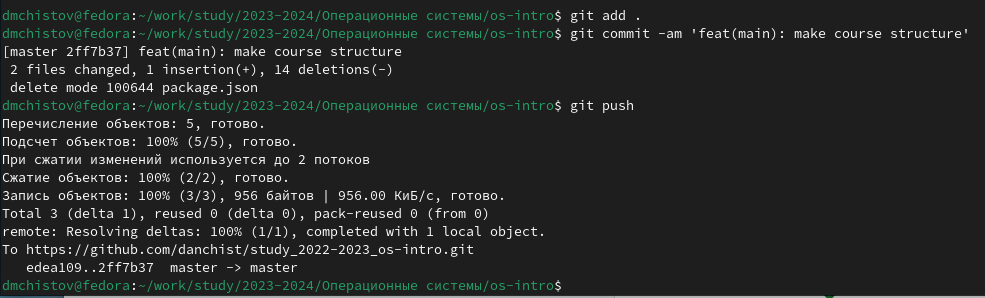{#fig:021 width=70%}

# Выводы

Выполняя данную работу я смог изучить идеологию и применение средств контроля версий и освоить умения по работе с git.

# Список литературы{.unnumbered}

[Лабораторная работы №2](https://esystem.rudn.ru/mod/page/view.php?id=1098790)
