---
## Front matter
lang: ru-RU
title: Лабораторная работа №4
subtitle: Операционные системы
author:
  - Чистов Д. М.
institute:
  - Российский университет дружбы народов, Москва, Россия
date: 09 Марта 2004

## i18n babel
babel-lang: russian
babel-otherlangs: english

## Formatting pdf
toc: false
toc-title: Содержание
slide_level: 2
aspectratio: 169
section-titles: true
theme: metropolis
header-includes:
 - \metroset{progressbar=frametitle,sectionpage=progressbar,numbering=fraction}
 - '\makeatletter'
 - '\beamer@ignorenonframefalse'
 - '\makeatother'

## Fonts
mainfont: Liberation Serif
romanfont: Liberation Serif
sansfont: Liberation Serif
monofont: Liberation Serif
mainfontoptions: Ligatures=TeX
romanfontoptions: Ligatures=TeX
---

# Вступительная информация

## Цель работы

Целью данной работы является получение навыков правильной работы с репозиториями git.

## Задание

1. Выполнить работу для тестового репозитория.
2. Преобразовать рабочий репозиторий в репозиторий с git-flow и conventional commits.

# Выполнение лабораторной работы

## Установка git-flow

Для установки gitflow для начала требуется подключить специальный репозиторий.

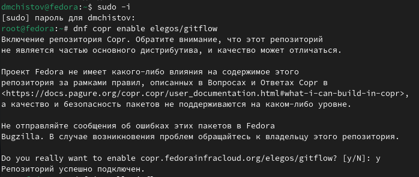{#fig:001 width=70%}

## Установка git-flow

После успешного подключения, устанавливаю gitflow.

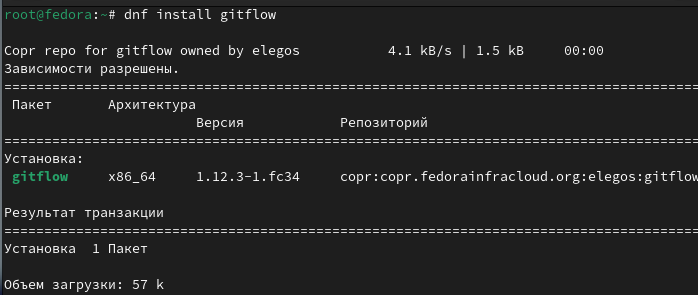{#fig:002 width=70%}

## Установка git-flow

На Node.js базируется программное обеспечение для семантического версионирования и общепринятых коммитов. Устанавливаю nodejs.

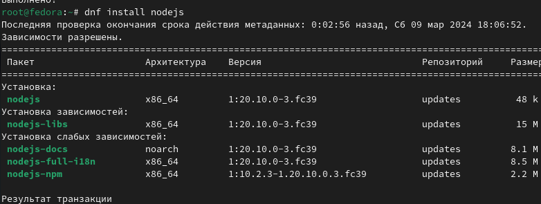{#fig:003 width=70%}

## Установка git-flow

Также устанавливаю pnpm, который требуется для работы nodejs.

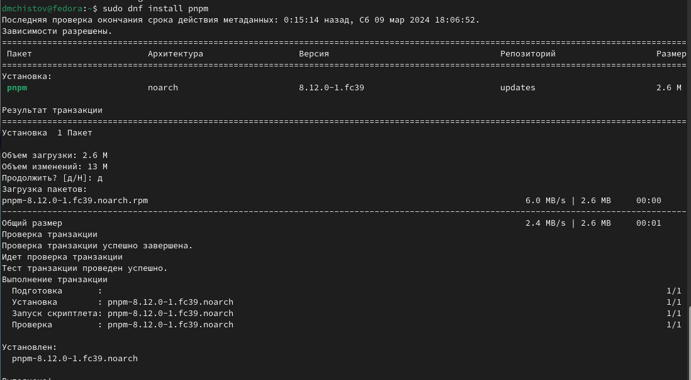{#fig:004 width=70%}

## Настройка NodeJS

Запускаю настройку pnpm, после чего перелогиниваюсь.

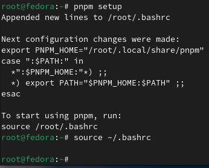{#fig:005 width=70%}

## Общепринятые коммиты

"pnpm add -g commitizen" используется для помощи в форматировании коммитов. При этом устанавливается скрипт git-cz, который и будет использоваться для коммитов.

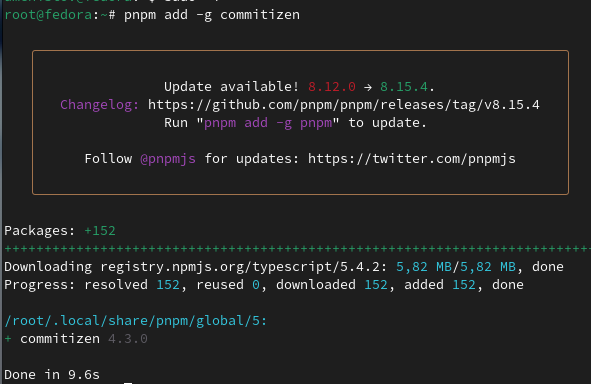{#fig:006 width=70%}

## Общепринятые коммиты

"standard-changelog" используется для помощи в создании логов.

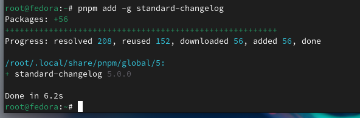{#fig:007 width=70%}

## Практический сценарий использования git

Требуется создать репозиторий, захожу на сайт GitHub и создаю репозиторий под названием "git-extended".

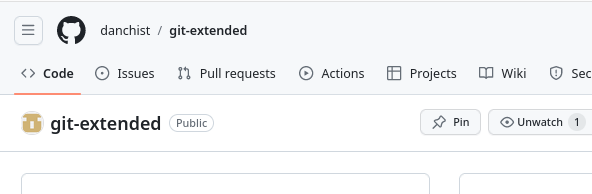{#fig:008 width=70%}

## Практический сценарий использования git

Теперь создаю репозитори локально у себя на виртульной машине, также внутри создаю файл README.md.

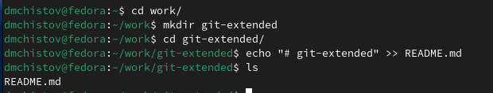{#fig:009 width=70%}

## Практический сценарий использования git

Инициализирую новый репозиторий и вношу изменения.

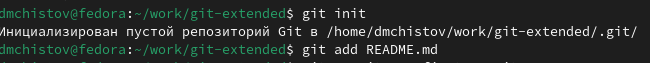{#fig:010 width=70%}

## Практический сценарий использования git

Делаю первый коммит и выкладываю его на GitHub.

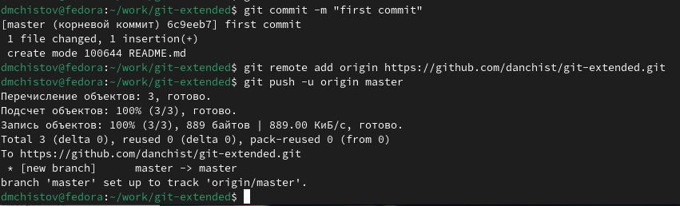{#fig:011 width=70%}

## Практический сценарий использования git

Репозиторий успешно прошёл конфигурацию.

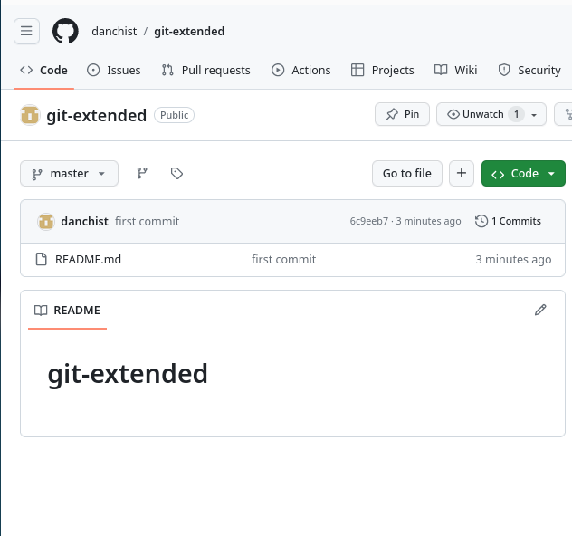{#fig:012 width=70%}

## Практический сценарий использования git

Начинаю конфигурацию пакетов Node.js.

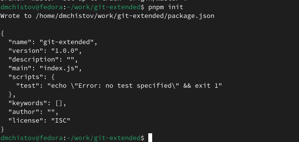{#fig:013 width=70%}

## Практический сценарий использования git

Был создан новый файл package.json. Его нужно отредактировать, как заявлено в задании. Меняю версию на "CC-BY-4.0", оставляю свои персональные данные - имя, фамилию, почту, ссылку на GitHub.

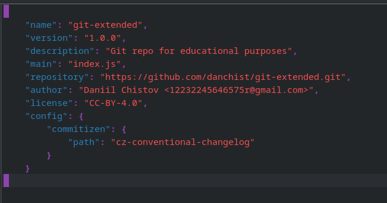{#fig:014 width=70%}

## Практический сценарий использования git

Добавляю новые файлы и выполняю коммит, пишу, что изменения не масштабные и указываю новый файл. После всего этого, выполняю git push.

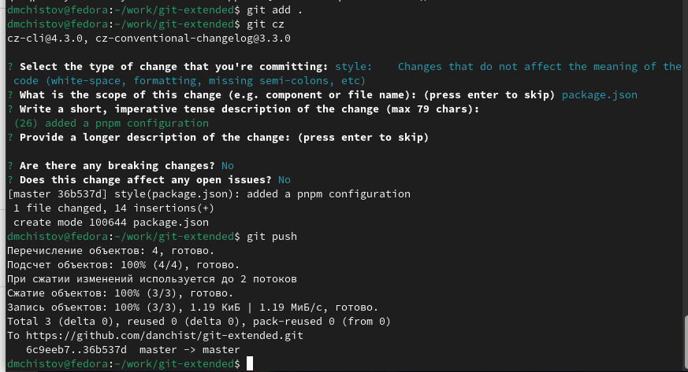{#fig:015 width=70%}

## Конфигурация gitflow

Инициализирую gitflow, указываю префикс "v" для ярлыков.

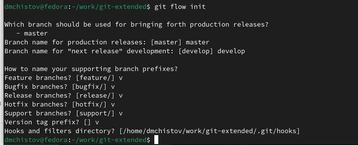{#fig:016 width=70%}

## Конфигурация gitflow

Удостоверяюсь, что я нахожу в ветке develop. Всё точно.

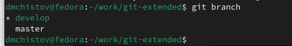{#fig:017 width=70%}

## Конфигурация gitflow

Загружаю весь репозиторий в хранилище.

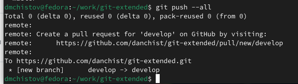{#fig:018 width=70%}

## Конфигурация gitflow

Установливаю внешнюю ветку как вышестоящую для этой ветки.

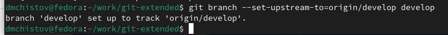{#fig:019 width=70%}

## Конфигурация gitflow

Создадаю релиз с версией 1.0.0.

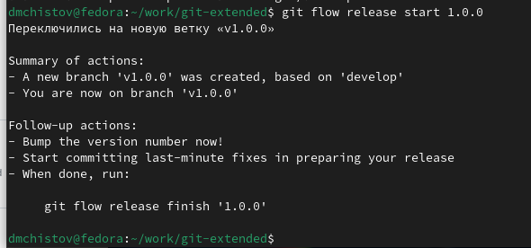{#fig:020 width=70%}

## Конфигурация gitflow

Создаю журнал изменений.

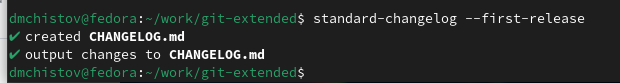{#fig:021 width=70%}

## Конфигурация gitflow

Добавляю журнал изменений в индекс.

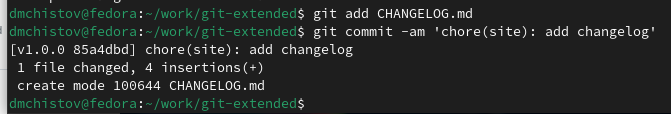{#fig:022 width=70%}

## Конфигурация gitflow

Загружаю релизную ветку в основную ветку, от меня требуют описать изменения.

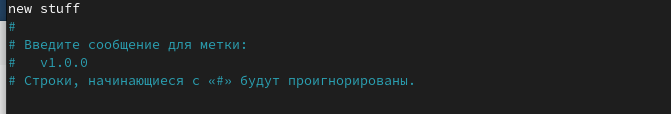{#fig:023 width=70%}

## Конфигурация gitflow

Релизная ветка успешно загружена.

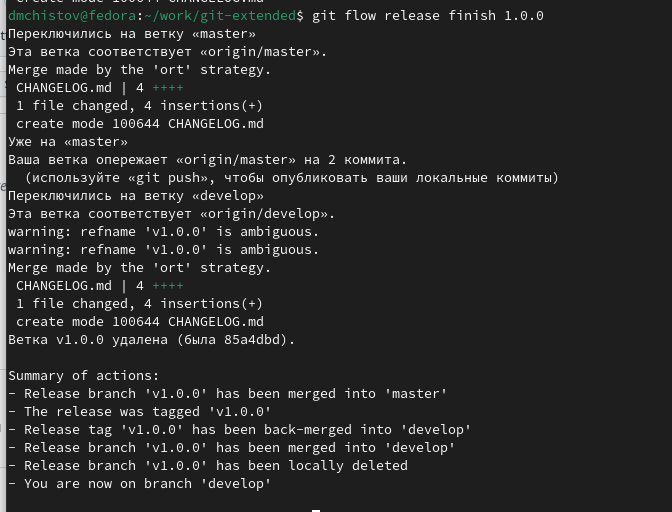{#fig:024 width=70%}

## Конфигурация gitflow

Отправляю данные на GitHub - пишу "git push --all".

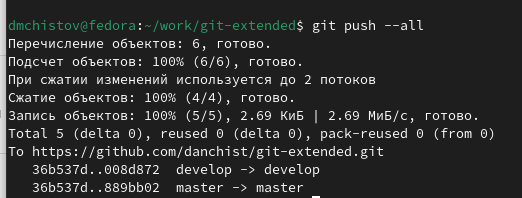{#fig:025 width=70%}

## Конфигурация gitflow

а затем "git push --tags".

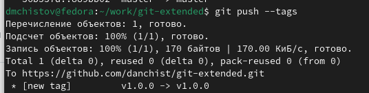{#fig:026 width=70%}

## Конфигурация gitflow

Создаю релиз на GitHub.

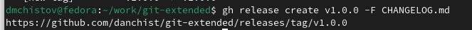{#fig:027 width=70%}

## Пример работы с репозиторием git

Создаю ветку для новой функциональности.

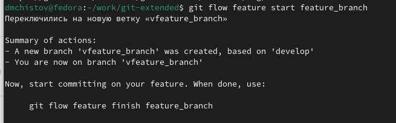{#fig:028 width=70%}

## Пример работы с репозиторием git

Допустим, я сделал какую-нибудь новую функцию. После окончанию своей работы, завершаю ветку новой функциональности - объединяю её с веткой develop.

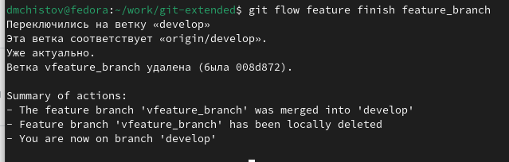{#fig:029 width=70%}

## Пример работы с репозиторием git

Создаю новый релиз на Gitflow - 1.2.3.

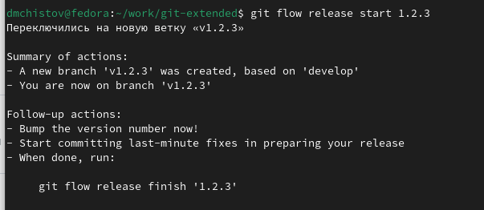{#fig:030 width=70%}

## Пример работы с репозиторием git

Обновляю номер версии в файле package.json на 1.2.3.

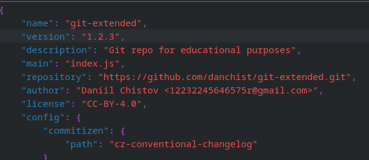{#fig:031 width=70%}

## Пример работы с репозиторием git

Создаю журнал изменений, добавляю его в индекс, делаю новый коммит.

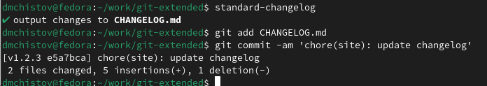{#fig:032 width=70%}

## Пример работы с репозиторием git

Загружаю релизную ветку в основную. Описываю изменения - "новый номер".

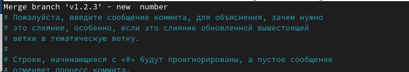{#fig:033 width=70%}

## Пример работы с репозиторием git

Добавляю подпись к изменениям.

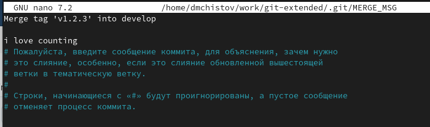{#fig:034 width=70%}

## Пример работы с репозиторием git

Ветка успешно загружена.

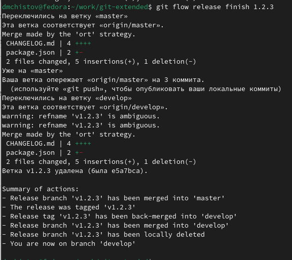{#fig:035 width=70%}

## Пример работы с репозиторием git

Отправляю изменения на GitHub.

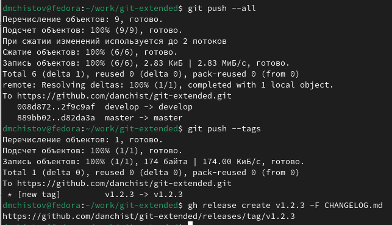{#fig:036 width=70%}

## Пример работы с репозиторием git

Задание выполнено успешно!.

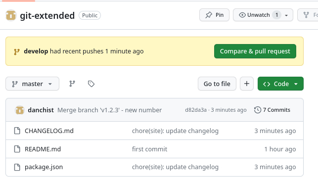{#fig:037 width=70%}

# Выводы

Выполняя данную работу я получил навыки правильной работы с репозиториями git.

## Список литературы{.unnumbered}

[Лабораторная работы №2](https://esystem.rudn.ru/mod/page/view.php?id=1098794)
