---
## Front matter
title: "Отчёт по лабораторной работе №4"
subtitle: "Операционные системы"
author: "Чистов Даниил Максимович"

## Generic otions
lang: ru-RU
toc-title: "Содержание"

## Bibliography
bibliography: bib/cite.bib
csl: pandoc/csl/gost-r-7-0-5-2008-numeric.csl

## Pdf output format
toc: true # Table of contents
toc-depth: 2
lof: true # List of figures
lot: false # List of tables
fontsize: 12pt
linestretch: 1.5
papersize: a4
documentclass: scrreprt
## I18n polyglossia
polyglossia-lang:
  name: russian
  options:
	- spelling=modern
	- babelshorthands=true
polyglossia-otherlangs:
  name: english
## I18n babel
babel-lang: russian
babel-otherlangs: english
## Fonts
mainfont: Liberation Serif
romanfont: Liberation Serif
sansfont: Liberation Serif
monofont: Liberation Serif
mainfontoptions: Ligatures=TeX
romanfontoptions: Ligatures=TeX
sansfontoptions: Ligatures=TeX,Scale=MatchLowercase
monofontoptions: Scale=MatchLowercase,Scale=0.9
## Biblatex
biblatex: true
biblio-style: "gost-numeric"
biblatexoptions:
  - parentracker=true
  - backend=biber
  - hyperref=auto
  - language=auto
  - autolang=other*
  - citestyle=gost-numeric
## Pandoc-crossref LaTeX customization
figureTitle: "Рис."
tableTitle: "Таблица"
listingTitle: "Листинг"
lofTitle: "Список иллюстраций"
lotTitle: "Список таблиц"
lolTitle: "Листинги"
## Misc options
indent: true
header-includes:
  - \usepackage{indentfirst}
  - \usepackage{float} # keep figures where there are in the text
  - \floatplacement{figure}{H} # keep figures where there are in the text
---

# Цель работы

Целью данной работы является получение навыков правильной работы с репозиториями git.

# Задание

1. Выполнить работу для тестового репозитория.
2. Преобразовать рабочий репозиторий в репозиторий с git-flow и conventional commits.

# Выполнение лабораторной работы

## Установка git-flow

Для установки gitflow для начала требуется подключить специальный репозиторий (рис. [-@fig:001]).

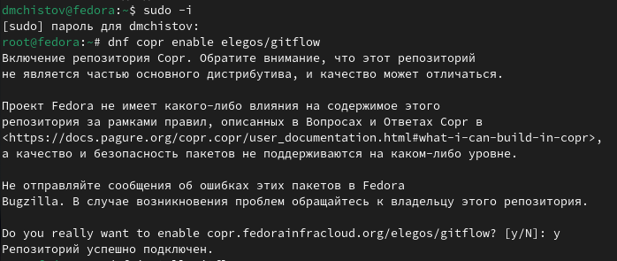{#fig:001 width=70%}

После успешного подключения, устанавливаю gitflow (рис. [-@fig:002]).

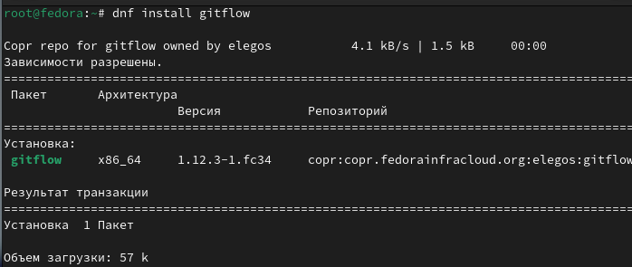{#fig:002 width=70%}

На Node.js базируется программное обеспечение для семантического версионирования и общепринятых коммитов. Устанавливаю nodejs (рис. [-@fig:003]).

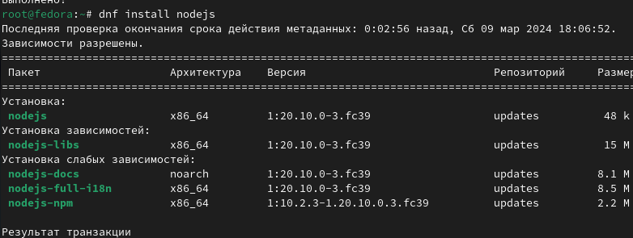{#fig:003 width=70%}

Также устанавливаю pnpm, который требуется для работы nodejs (рис. [-@fig:004]).

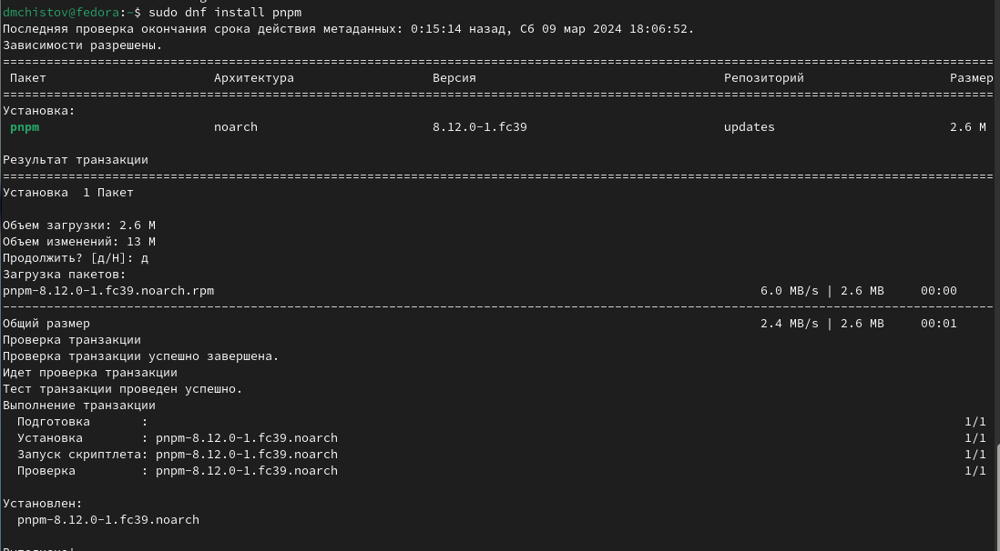{#fig:004 width=70%}

## Настройка NodeJS

Запускаю настройку pnpm, после чего перелогиниваюсь (рис. [-@fig:005]).

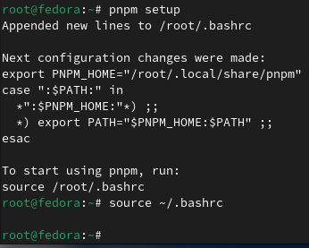{#fig:005 width=70%}

## Общепринятые коммиты

"pnpm add -g commitizen" используется для помощи в форматировании коммитов. При этом устанавливается скрипт git-cz, который и будет использоваться для коммитов (рис. [-@fig:006]).

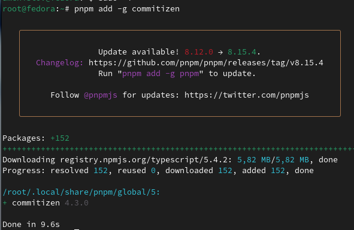{#fig:006 width=70%}

"standard-changelog" используется для помощи в создании логов (рис. [-@fig:007]).

{#fig:007 width=70%}

## Практический сценарий использования git

Требуется создать репозиторий, захожу на сайт GitHub и создаю репозиторий под названием "git-extended" (рис. [-@fig:008]).

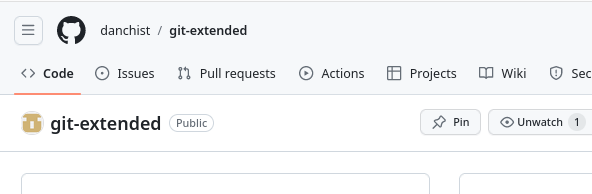{#fig:008 width=70%}

Теперь создаю репозитори локально у себя на виртульной машине, также внутри создаю файл README.md (рис. [-@fig:009]).

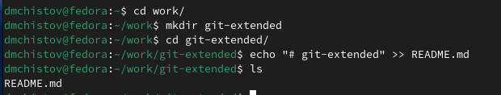{#fig:009 width=70%}

Инициализирую новый репозиторий и вношу изменения (рис. [-@fig:010]).

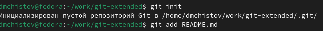{#fig:010 width=70%}

Делаю первый коммит и выкладываю его на GitHub (рис. [-@fig:011]).

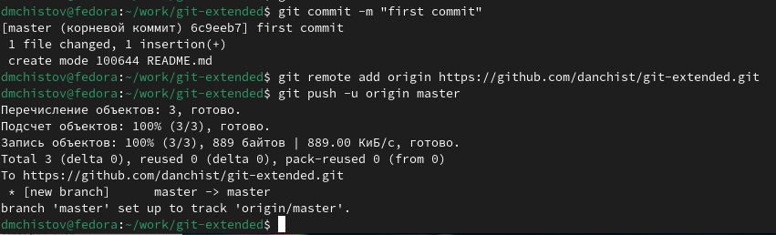{#fig:011 width=70%}

Репозиторий успешно прошёл конфигурацию (рис. [-@fig:012]).

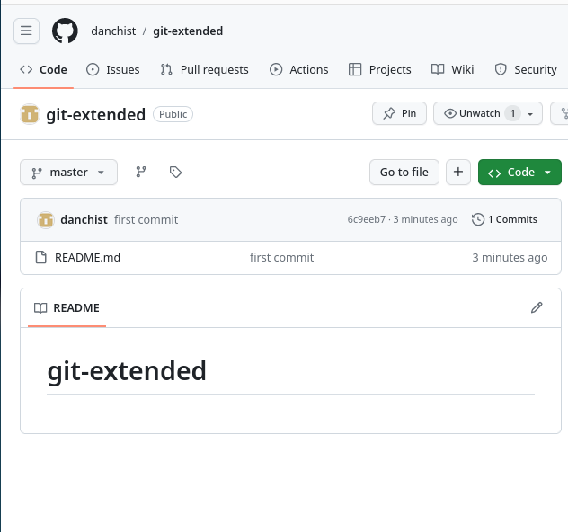{#fig:012 width=70%}

Начинаю конфигурацию пакетов Node.js (рис. [-@fig:013]).

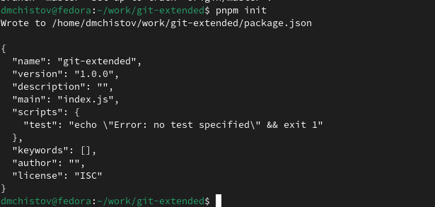{#fig:013 width=70%}

Был создан новый файл package.json. Его нужно отредактировать, как заявлено в задании. Меняю версию на "CC-BY-4.0", оставляю свои персональные данные - имя, фамилию, почту, ссылку на GitHub (рис. [-@fig:014]).

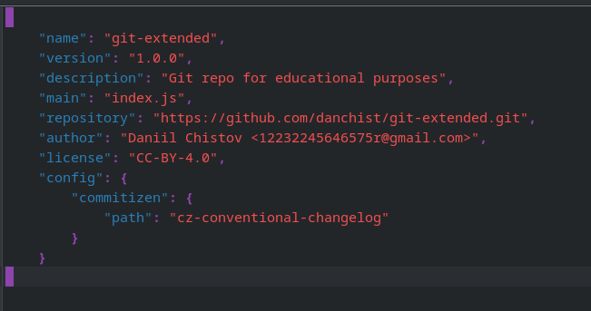{#fig:014 width=70%}

Добавляю новые файлы и выполняю коммит, пишу, что изменения не масштабные и указываю новый файл. После всего этого, выполняю git push (рис. [-@fig:015]).

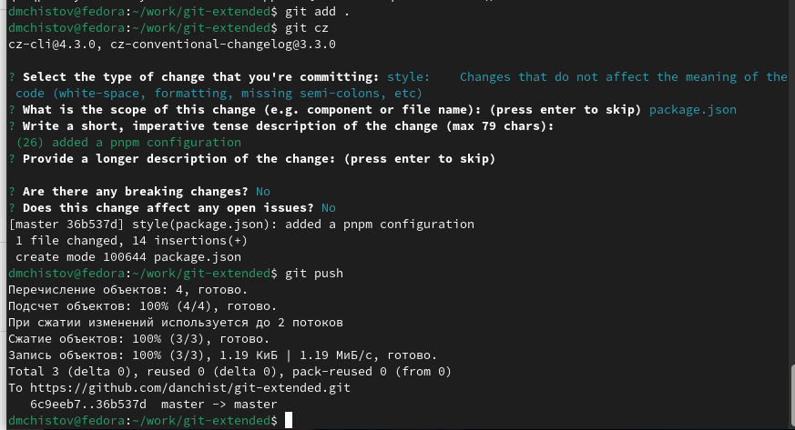{#fig:015 width=70%}

## Конфигурация gitflow

Инициализирую gitflow, указываю префикс "v" для ярлыков (рис. [-@fig:016]).

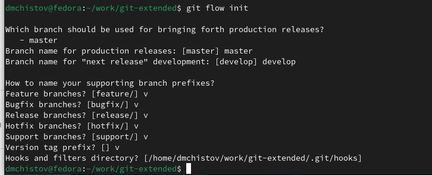{#fig:016 width=70%}

Удостоверяюсь, что я нахожу в ветке develop. Всё точно (рис. [-@fig:017]).

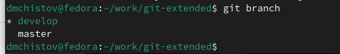{#fig:017 width=70%}

Загружаю весь репозиторий в хранилище (рис. [-@fig:018]).

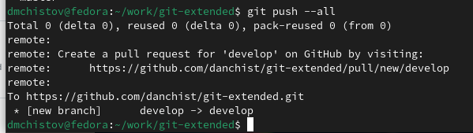{#fig:018 width=70%}

Установливаю внешнюю ветку как вышестоящую для этой ветки (рис. [-@fig:019]).

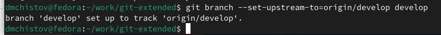{#fig:019 width=70%}

Создадаю релиз с версией 1.0.0 (рис. [-@fig:020]).

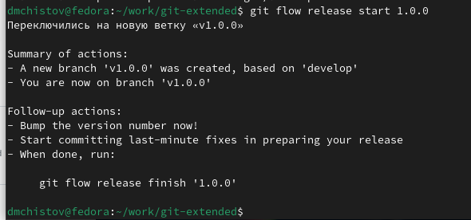{#fig:020 width=70%}

Создаю журнал изменений (рис. [-@fig:021]).

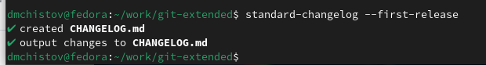{#fig:021 width=70%}

Добавляю журнал изменений в индекс (рис. [-@fig:022]).

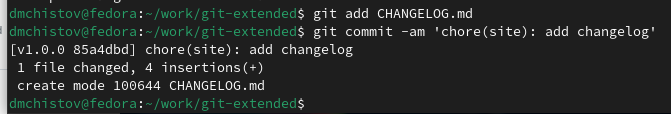{#fig:022 width=70%}

Загружаю релизную ветку в основную ветку, от меня требуют описать изменения (рис. [-@fig:023]).

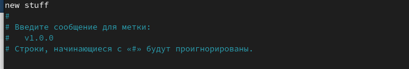{#fig:023 width=70%}

Релизная ветка успешно загружена (рис. [-@fig:024]).

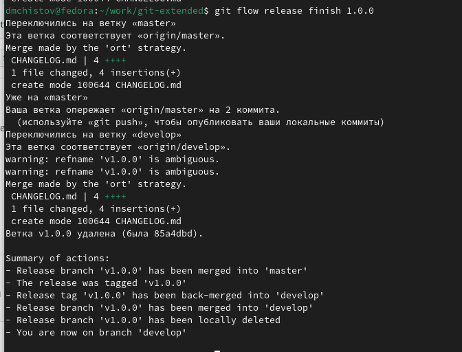{#fig:024 width=70%}

Отправляю данные на GitHub - пишу "git push --all" (рис. [-@fig:025]), а затем "git push --tags"  (рис. [-@fig:026]).

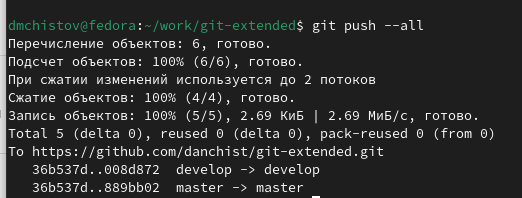{#fig:025 width=70%}

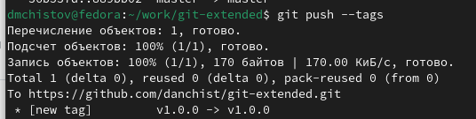{#fig:026 width=70%}

Создаю релиз на GitHub (рис. [-@fig:027]).

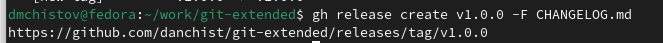{#fig:027 width=70%}

## Пример работы с репозиторием git

Создаю ветку для новой функциональности (рис. [-@fig:028]).

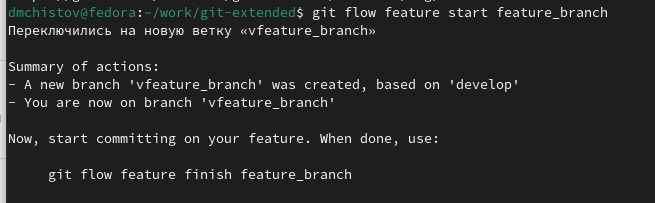{#fig:028 width=70%}

Допустим, я сделал какую-нибудь новую функцию. После окончанию своей работы, завершаю ветку новой функциональности - объединяю её с веткой develop (рис. [-@fig:029]).

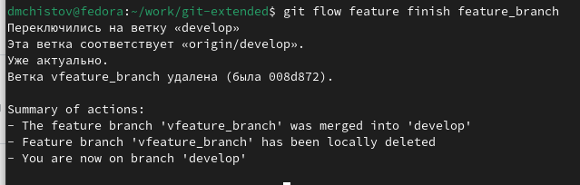{#fig:029 width=70%}

Создаю новый релиз на Gitflow - 1.2.3 (рис. [-@fig:030]).

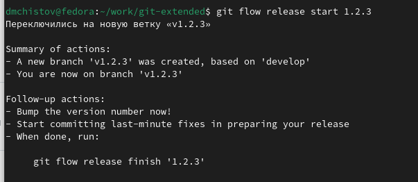{#fig:030 width=70%}

Обновляю номер версии в файле package.json на 1.2.3 (рис. [-@fig:031]).

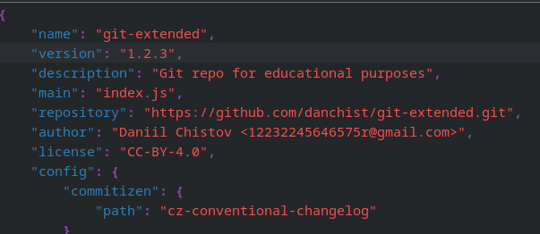{#fig:031 width=70%}

Создаю журнал изменений, добавляю его в индекс, делаю новый коммит (рис. [-@fig:032]).

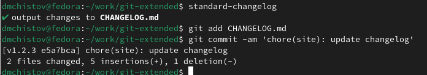{#fig:032 width=70%}

Загружаю релизную ветку в основную. Описываю изменения - "новый номер" (рис. [-@fig:033]).

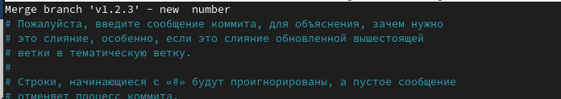{#fig:033 width=70%}

Добавляю подпись к изменениям (рис. [-@fig:034]).

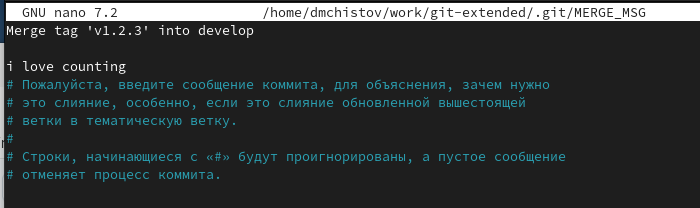{#fig:034 width=70%}

Ветка успешно загружена (рис. [-@fig:035]).

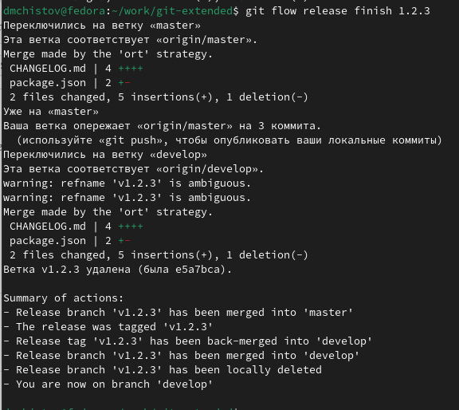{#fig:035 width=70%}

Отправляю изменения на GitHub (рис. [-@fig:036]).

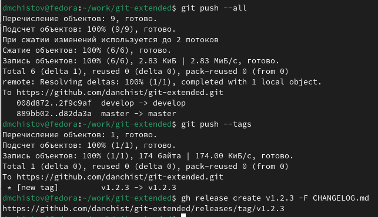{#fig:036 width=70%}

Задание выполнено успешно! (рис. [-@fig:037]).

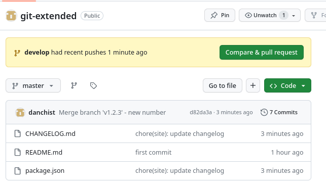{#fig:037 width=70%}

# Выводы

Выполняя данную работу я получил навыки правильной работы с репозиториями git.

# Список литературы{.unnumbered}

[Лабораторная работы №2](https://esystem.rudn.ru/mod/page/view.php?id=1098794)
