---
## Front matter
lang: ru-RU
title: Лабораторная работа №7
subtitle: Операционные системы
author:
  - Чистов Д. М.
institute:
  - Российский университет дружбы народов, Москва, Россия
date: 23 Марта 2024

## i18n babel
babel-lang: russian
babel-otherlangs: english

## Formatting pdf
toc: false
toc-title: Содержание
slide_level: 2
aspectratio: 169
section-titles: true
theme: metropolis
header-includes:
 - \metroset{progressbar=frametitle,sectionpage=progressbar,numbering=fraction}
 - '\makeatletter'
 - '\beamer@ignorenonframefalse'
 - '\makeatother'

## Fonts
mainfont: Liberation Serif
romanfont: Liberation Serif
sansfont: Liberation Serif
monofont: Liberation Serif
mainfontoptions: Ligatures=TeX
romanfontoptions: Ligatures=TeX
---

# Вступительная информация

## Цель работы

Целью данной работы является ознакомление с файловой системой Linux, её структурой, именами и содержанием каталогов. Приобретение практических навыков по применению команд для работы с файлами и каталогами, по управлению процессами (и работами), по проверке использования диска и обслуживанию файловой системы.

# Задание

Выполнить поставленный набор заданий - состоящий из:
- набора примеров в теоретической части
- задания для самостоятельного выполнения

# Выполнение лабораторной работы

# Пример 1 - Копирование файлов и каталогов

## Пример 1 - Копирование файлов и каталогов

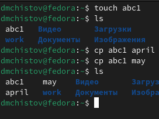{#fig:001 width=50%}

## Пример 1 - Копирование файлов и каталогов

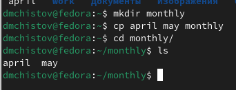{#fig:002 width=70%}

## Пример 1 - Копирование файлов и каталогов

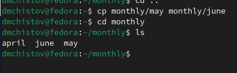{#fig:003 width=70%}

## Пример 1 - Копирование файлов и каталогов

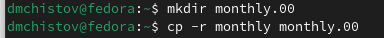{#fig:004 width=70%}

## Пример 1 - Копирование файлов и каталогов

{#fig:005 width=70%}

# Пример 2 - Перемещение и переименование файлов и каталогов

## Пример 2 - Перемещение и переименование файлов и каталогов

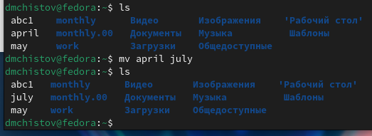{#fig:006 width=70%}

## Пример 2 - Перемещение и переименование файлов и каталогов

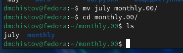{#fig:007 width=70%}

## Пример 2 - Перемещение и переименование файлов и каталогов

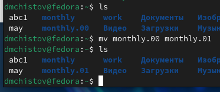{#fig:008 width=70%}

## Пример 2 - Перемещение и переименование файлов и каталогов

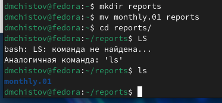{#fig:009 width=70%}

## Пример 2 - Перемещение и переименование файлов и каталогов

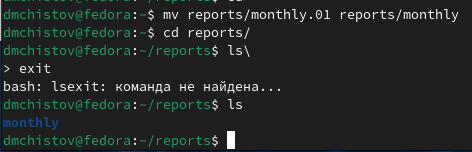{#fig:010 width=70%}

# Пример 3 - Изменение прав доступа

## Пример 3 - Изменение прав доступа

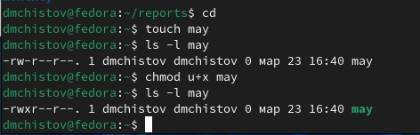{#fig:011 width=70%}

## Пример 3 - Изменение прав доступа

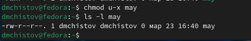{#fig:012 width=70%}

## Пример 3 - Изменение прав доступа

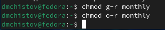{#fig:013 width=70%}

## Пример 3 - Изменение прав доступа

{#fig:014 width=70%}

# Выполнение поставленных задач

## Выполнение поставленных задач

Приступлю к выполнению основных задач. Копирую файл /usr/include/sys/io.h в домашний каталог и называю его equipment.

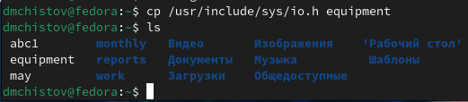{#fig:015 width=70%}

## Выполнение поставленных задач

Создаю каталог ski.plases.

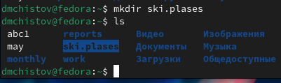{#fig:016 width=70%}

## Выполнение поставленных задач

Перемещаю файл equipment в каталог ~/ski.plases.

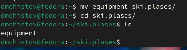{#fig:017 width=70%}

## Выполнение поставленных задач

Изменяю имя файла ~/ski.plases/equipment в ~/ski.plases/equiplist.

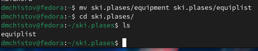{#fig:018 width=70%}

## Выполнение поставленных задач

Создаю в домашнем каталоге файл abc1 и копирую его в каталог ~/ski.plases, называю его equiplist2.

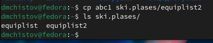{#fig:019 width=70%}

## Выполнение поставленных задач

Создаю каталог с именем equipment в каталоге ~/ski.plases.

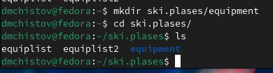{#fig:020 width=70%}

## Выполнение поставленных задач

Перемещаю файлы ~/ski.plases/equiplist и equiplist2 в каталог ~/ski.plases/equipment.

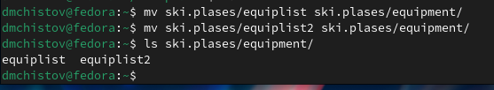{#fig:021 width=70%}

## Выполнение поставленных задач

Создаю и перемещаю каталог ~/newdir в каталог ~/ski.plases и называю его plans.

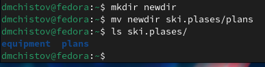{#fig:022 width=70%}

# Присваивание и отмена прав у файлов/каталогов

## Присваивание и отмена прав у файлов/каталогов

Присваиваю или убираю права от созданных мною файлов australia, my_os, play, feathers так, чтобы права соответствовали тем, которые указаны в задании.

## Присваивание и отмена прав у файлов/каталогов

Изменяю права australia - отнимаю права у группы и остальных выполнять файл.

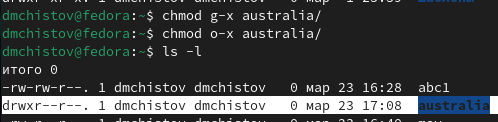{#fig:023 width=70%}

## Присваивание и отмена прав у файлов/каталогов

Изменяю права play - отнимаю права у группы и остальных читать файл.

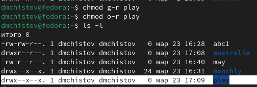{#fig:024 width=70%}

## Присваивание и отмена прав у файлов/каталогов

Изменяю права my_os - присваиваю право владельцу файла выполнять его, но отнимаю права у владельца, группы, и других записывать в файл.

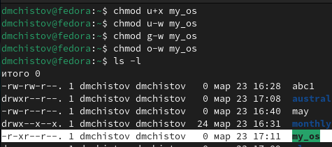{#fig:025 width=70%}

## Присваивание и отмена прав у файлов/каталогов

Изменяю права feathers - присваиваю праву группе записывать в файл.

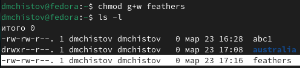{#fig:026 width=70%}

# Базовые навыки работы с Linux

## Базовые навыки работы с Linux

Читаю содержимое файла password, находящегося в папке etc.

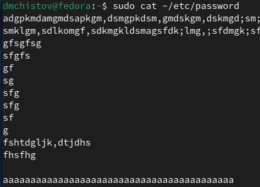{#fig:027 width=70%}

## Базовые навыки работы с Linux

Копирую файл feathers в файл file.old.

{#fig:028 width=70%}

## Базовые навыки работы с Linux

Перемещаю file.old в директорию play.

{#fig:029 width=70%}

## Базовые навыки работы с Linux

Копирую каталог play в каталог fun.

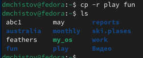{#fig:030 width=70%}

## Базовые навыки работы с Linux

Перемещаю каталог fun в каталог play и называю его games.

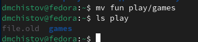{#fig:031 width=70%}

## Базовые навыки работы с Linux

Изменяю права файлу feathers - владелец теперь не может его прочитать.

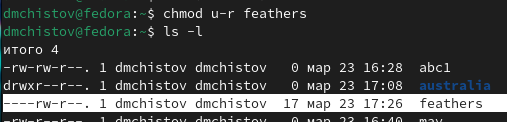{#fig:032 width=70%}

## Базовые навыки работы с Linux

Проверяю, действительно я больше не могу прочитать этот файл.

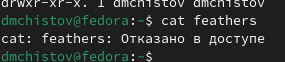{#fig:033 width=70%}

## Базовые навыки работы с Linux

Также, попробую скопировать файл. Не получается.

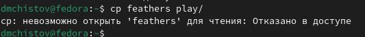{#fig:034 width=70%}

## Базовые навыки работы с Linux

Изменяю права файлу feathers - владелец теперь снова может его прочитать.

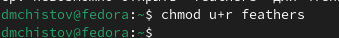{#fig:035 width=70%}

## Базовые навыки работы с Linux

Изменяю права каталогу play - владелец теперь не имеет к нему доступ.

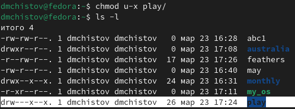{#fig:036 width=70%}

## Базовые навыки работы с Linux

Проверяю, я действительно не имею доступа к каталогу.

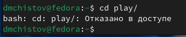{#fig:037 width=70%}

## Базовые навыки работы с Linux

Возвращаю права доступа каталогу play.

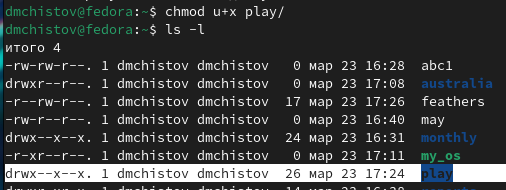{#fig:038 width=70%}

# Изучение команд с помощью man

От меня требуется прочитать о наборе команд с помощью утилиты man, а затем кратко их описать.

## Изучение команд с помощью man

Команда mount - монтирует выбранное устройства с памятью к системе.

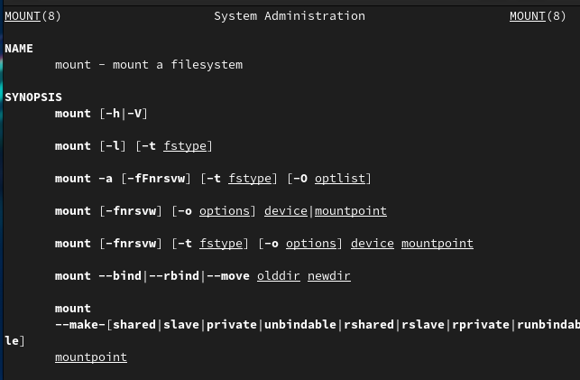{#fig:039 width=70%}

## Изучение команд с помощью man

Команда fsck - проверяю файловую систему Linux и имеет возможность её починить, если требуется.

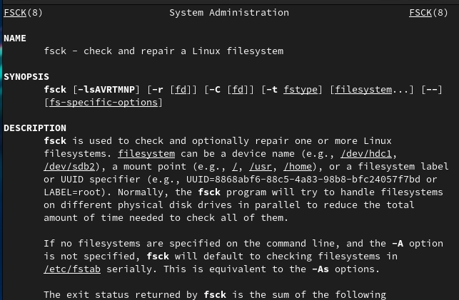{#fig:040 width=70%}

## Изучение команд с помощью man

Команда mkfs -  может создавать файловую систему Linux, зачастую на новых разделах диска.

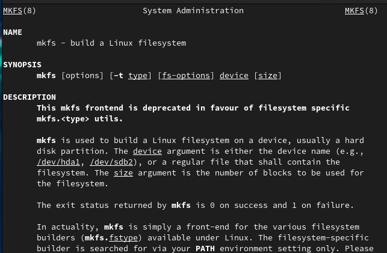{#fig:041 width=70%}

## Изучение команд с помощью man

Команда kill - завершает указанный процесс, т.е. он прекращает свою работу.

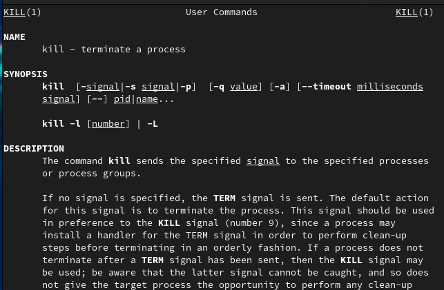{#fig:042 width=70%}

# Выводы

В результате выполненения данной работы я ознакомился с файловой системой Linux, её структурой, именами и содержанием каталогов. Приобрёл практические навыки по применению команд для работы с файлами и каталогами, по управлению процессами (и работами), по проверке использования диска и обслуживанию файловой системы.

# Список литературы{.unnumbered}

[Лабораторная работы №7](https://esystem.rudn.ru/pluginfile.php/2288087/mod_resource/content/4/005-lab_files.pdf)

