---
## Front matter
title: "Отчёт по лабораторной работе №7"
subtitle: "Операционные системы"
author: "Чистов Даниил Максимович"

## Generic otions
lang: ru-RU
toc-title: "Содержание"

## Bibliography
bibliography: bib/cite.bib
csl: pandoc/csl/gost-r-7-0-5-2008-numeric.csl

## Pdf output format
toc: true # Table of contents
toc-depth: 2
lof: true # List of figures
lot: false # List of tables
fontsize: 12pt
linestretch: 1.5
papersize: a4
documentclass: scrreprt
## I18n polyglossia
polyglossia-lang:
  name: russian
  options:
	- spelling=modern
	- babelshorthands=true
polyglossia-otherlangs:
  name: english
## I18n babel
babel-lang: russian
babel-otherlangs: english
## Fonts
mainfont: Liberation Serif
romanfont: Liberation Serif
sansfont: Liberation Serif
monofont: Liberation Serif
mainfontoptions: Ligatures=TeX
romanfontoptions: Ligatures=TeX
sansfontoptions: Ligatures=TeX,Scale=MatchLowercase
monofontoptions: Scale=MatchLowercase,Scale=0.9
## Biblatex
biblatex: true
biblio-style: "gost-numeric"
biblatexoptions:
  - parentracker=true
  - backend=biber
  - hyperref=auto
  - language=auto
  - autolang=other*
  - citestyle=gost-numeric
## Pandoc-crossref LaTeX customization
figureTitle: "Рис."
tableTitle: "Таблица"
listingTitle: "Листинг"
lofTitle: "Список иллюстраций"
lotTitle: "Список таблиц"
lolTitle: "Листинги"
## Misc options
indent: true
header-includes:
  - \usepackage{indentfirst}
  - \usepackage{float} # keep figures where there are in the text
  - \floatplacement{figure}{H} # keep figures where there are in the text
---

# Цель работы

Целью данной работы является ознакомление с файловой системой Linux, её структурой, именами и содержанием каталогов. Приобретение практических навыков по применению команд для работы с файлами и каталогами, по управлению процессами (и работами), по проверке использования диска и обслуживанию файловой системы.

# Задание

Выполнить поставленный набор заданий

# Выполнение лабораторной работы

От меня требуется выполнить несколько примеров из теоретического материала лабораторной работы.

# Пример 1 - Копирование файлов и каталогов

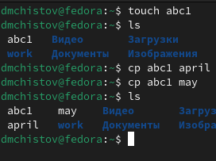{#fig:001 width=70%}

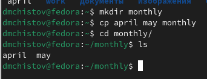{#fig:002 width=70%}

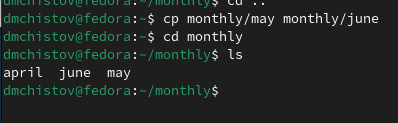{#fig:003 width=70%}

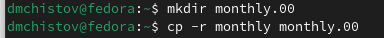{#fig:004 width=70%}

{#fig:005 width=70%}

# Пример 2 - Перемещение и переименование файлов и каталогов

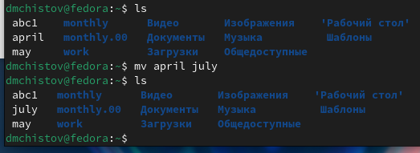{#fig:006 width=70%}

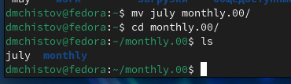{#fig:007 width=70%}

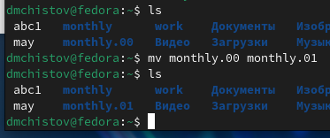{#fig:008 width=70%}

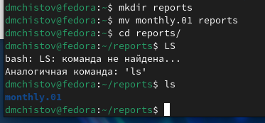{#fig:009 width=70%}

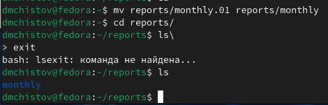{#fig:010 width=70%}

# Пример 3 - Изменение прав доступа

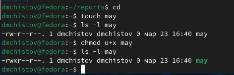{#fig:011 width=70%}

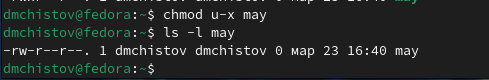{#fig:012 width=70%}

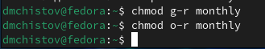{#fig:013 width=70%}

{#fig:014 width=70%}

# Выполнение поставленных задач

Приступлю к выполнению основных задач. Копирую файл /usr/include/sys/io.h в домашний каталог и называю его equipment (рис. [-@fig:015]).

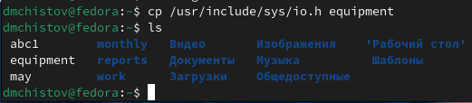{#fig:015 width=70%}

Создаю каталог ski.plases (рис. [-@fig:016]).

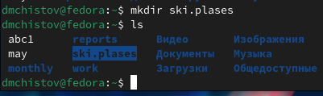{#fig:016 width=70%}

Перемещаю файл equipment в каталог ~/ski.plases (рис. [-@fig:017]).

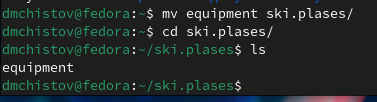{#fig:017 width=70%}

Изменяю имя файла ~/ski.plases/equipment в ~/ski.plases/equiplist (рис. [-@fig:018]).

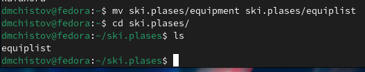{#fig:018 width=70%}

Создаю в домашнем каталоге файл abc1 и копирую его в каталог ~/ski.plases, называю его equiplist2 (рис. [-@fig:019]).

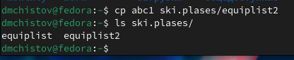{#fig:019 width=70%}

Создаю каталог с именем equipment в каталоге ~/ski.plases (рис. [-@fig:020]).

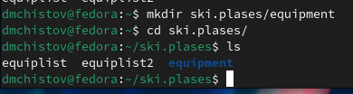{#fig:020 width=70%}

Перемещаю файлы ~/ski.plases/equiplist и equiplist2 в каталог ~/ski.plases/equipment (рис. [-@fig:021]).

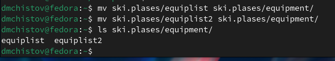{#fig:021 width=70%}

Создаю и перемещаю каталог ~/newdir в каталог ~/ski.plases и называю его plans (рис. [-@fig:022]).

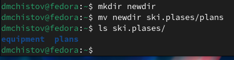{#fig:022 width=70%}

Присваиваю или убираю права от созданных мною файлов australia, my_os, play, feathers так, чтобы права соответствовали тем, которые указаны в задании.

Изменяю права australia - отнимаю права у группы и остальных выполнять файл (рис. [-@fig:023]).

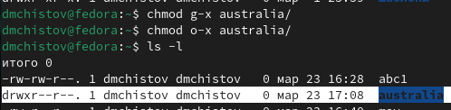{#fig:023 width=70%}

Изменяю права play - отнимаю права у группы и остальных читать файл (рис. [-@fig:024]).

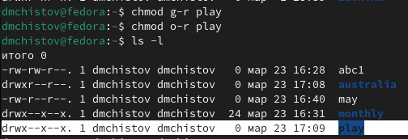{#fig:024 width=70%}

Изменяю права my_os - присваиваю право владельцу файла выполнять его, но отнимаю права у владельца, группы, и других записывать в файл (рис. [-@fig:025]).

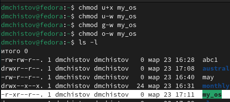{#fig:025 width=70%}

Изменяю права feathers - присваиваю праву группе записывать в файл (рис. [-@fig:026]).

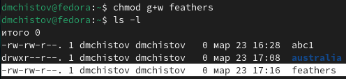{#fig:026 width=70%}

Читаю содержимое файла password, находящегося в папке etc (рис. [-@fig:027]).

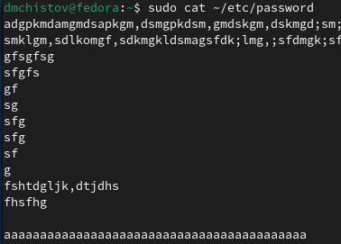{#fig:027 width=70%}

Копирую файл feathers в файл file.old (рис. [-@fig:028]).

{#fig:028 width=70%}

Перемещаю file.old в директорию play (рис. [-@fig:029]).

{#fig:029 width=70%}

Копирую каталог play в каталог fun (рис. [-@fig:030]).

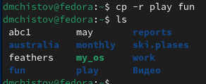{#fig:030 width=70%}

Перемещаю каталог fun в каталог play и называю его games (рис. [-@fig:031]).

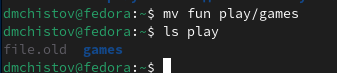{#fig:031 width=70%}

Изменяю права файлу feathers - владелец теперь не может его прочитать (рис. [-@fig:032]).

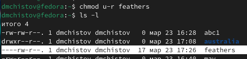{#fig:032 width=70%}

Проверяю, действительно я больше не могу прочитать этот файл (рис. [-@fig:033]).

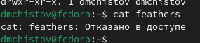{#fig:033 width=70%}

Также, попробую скопировать файл. Не получается (рис. [-@fig:034]).

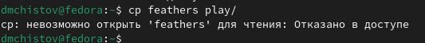{#fig:034 width=70%}

Изменяю права файлу feathers - владелец теперь снова может его прочитать (рис. [-@fig:035]).

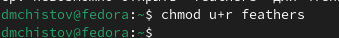{#fig:035 width=70%}

Изменяю права каталогу play - владелец теперь не имеет к нему доступ (рис. [-@fig:036]).

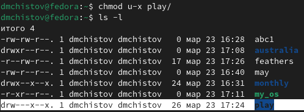{#fig:036 width=70%}

Проверяю, я действительно не имею доступа к каталогу (рис. [-@fig:037]).

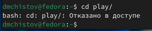{#fig:037 width=70%}

Возвращаю права доступа каталогу play (рис. [-@fig:038]).

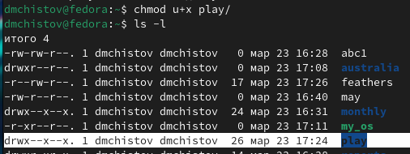{#fig:038 width=70%}

От меня требуется прочитать о наборе команд с помощью утилиты man, а затем кратко их описать.

Команда mount - монтирует выбранное устройства с памятью к системе (рис. [-@fig:039]).

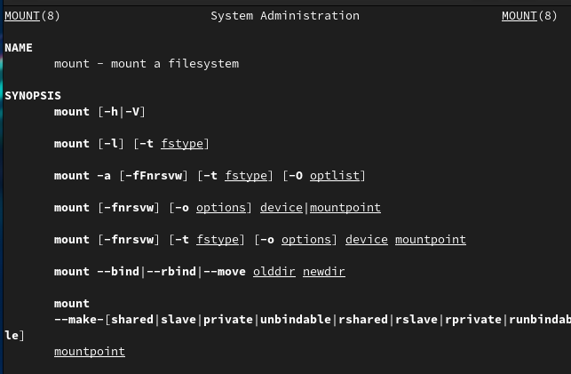{#fig:039 width=70%}

Команда fsck - проверяю файловую систему Linux и имеет возможность её починить, если требуется (рис. [-@fig:040]).

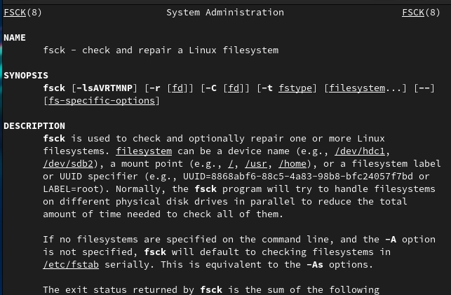{#fig:040 width=70%}

Команда mkfs -  может создавать файловую систему Linux, зачастую на новых разделах диска (рис. [-@fig:041]).

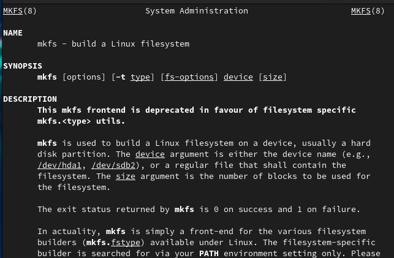{#fig:041 width=70%}

Команда kill - завершает указанный процесс, т.е. он прекращает свою работу (рис. [-@fig:042]).

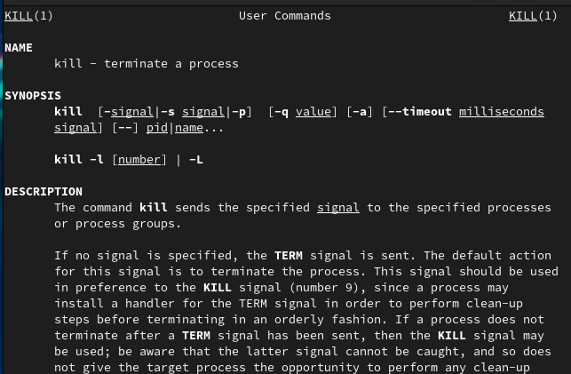{#fig:042 width=70%}

# Выводы

В результате выполненения данной работы я ознакомился с файловой системой Linux, её структурой, именами и содержанием каталогов. Приобрёл практические навыки по применению команд для работы с файлами и каталогами, по управлению процессами (и работами), по проверке использования диска и обслуживанию файловой системы.

# Список литературы{.unnumbered}

[Лабораторная работы №7](https://esystem.rudn.ru/pluginfile.php/2288087/mod_resource/content/4/005-lab_files.pdf)
