---
## Front matter
lang: ru-RU
title: Лабораторная работа №8
subtitle: Операционные системы
author:
  - Чистов Д. М.
institute:
  - Российский университет дружбы народов, Москва, Россия
date: 30 Марта 2024

## i18n babel
babel-lang: russian
babel-otherlangs: english

## Formatting pdf
toc: false
toc-title: Содержание
slide_level: 2
aspectratio: 169
section-titles: true
theme: metropolis
header-includes:
 - \metroset{progressbar=frametitle,sectionpage=progressbar,numbering=fraction}
 - '\makeatletter'
 - '\beamer@ignorenonframefalse'
 - '\makeatother'

## Fonts
mainfont: Liberation Serif
romanfont: Liberation Serif
sansfont: Liberation Serif
monofont: Liberation Serif
mainfontoptions: Ligatures=TeX
romanfontoptions: Ligatures=TeX
---

# Вступительная информация

# Цель работы

Целью данной работы является ознакомление с инструментами поиска файлов и фильтрации текстовых данных. Приобретение практических навыков: по управлению процессами (и заданиями), по проверке использования диска и обслуживанию файловых систем.

## Выполнение лабораторной работы

Приступлю к выполнению работы - вхожу в систему под своим логином и паролём. Нужно записать в file.txt названия файлов, содержащихся в каталоге /etc. Символом ">" перевожу вывод команлы ls -lR /etc в file.txt, который автоматически будет создан. Проверяю.

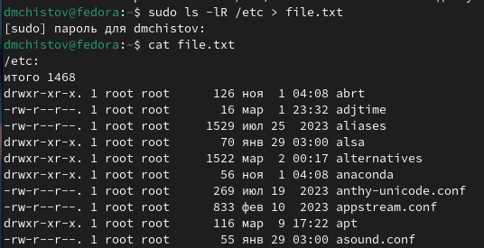{#fig:001 width=70%}

## Выполнение лабораторной работы

Теперь  в этот же файл мне нужно добавить названия файлов, содержащихся в вашем домашнем каталоге. Принцип такой же, только вместо ">" пишу ">>", чтобы войти в режим добавления.

{#fig:002 width=70%}

## Выполнение лабораторной работы

Вывожу имена всех файлов из file.txt, имеющих расширение .conf с помощью утилиты grep.

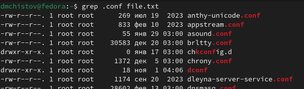{#fig:003 width=70%}

## Выполнение лабораторной работы

Теперь по похожу принципу из прошлых задач, записываю вывод из прошлой команды в файл conf.txt.

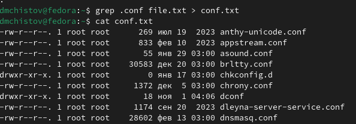{#fig:004 width=70%}

## Выполнение лабораторной работы

Нужно найти все каталоги в домашней папке, начинающиеся на "c". Это можно сделать несколькими способами. Первый - утилитой find.

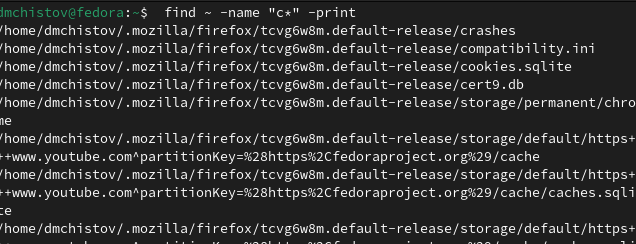{#fig:005 width=70%}

## Выполнение лабораторной работы

Второй способ - воспользоваться конвеером и утилитой grep.

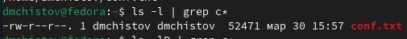{#fig:006 width=70%}

## Выполнение лабораторной работы

Вывожу имена файлов из каталога /etc, начинающиеся с символа h.

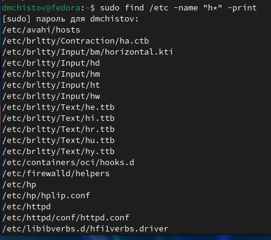{#fig:007 width=70%}

## Выполнение лабораторной работы

Запускаю процесс в фоновом режиме, добавив символ & в конец команды. Процесс будет записывать в файл ~/logfile файлы, имена которых начинаются с log.

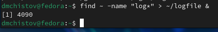{#fig:008 width=70%}

## Выполнение лабораторной работы

Теперь завершаю процесс, удалив файл logfile.

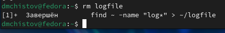{#fig:009 width=70%}

## Выполнение лабораторной работы

Запускаю в фоновом режиме редактор gedit.

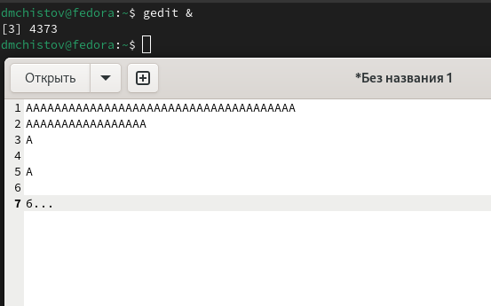{#fig:010 width=70%}

## Выполнение лабораторной работы

С помошью конвеера и grep нахожу ID запущенного процесса gedit.

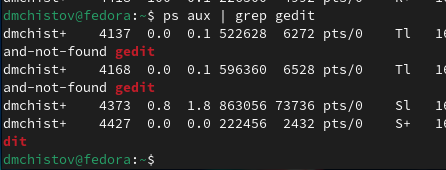{#fig:011 width=70%}

## Выполнение лабораторной работы

С помошью конвеера и grep нахожу ID запущенного процесса gedit.

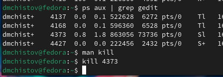{#fig:012 width=70%}

## Выполнение лабораторной работы

Командой df узнаю размер выбранной мной файловой системы).

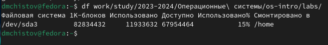{#fig:013 width=70%}

## Выполнение лабораторной работы

Командой du и опцией -h ("по человечески") узнаю размер директорий выбранной мной файловой системы .

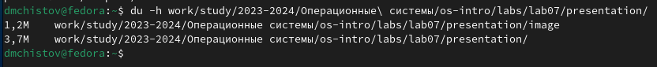{#fig:014 width=70%}

## Выполнение лабораторной работы

Командой man изучаю команду find и обнаруживаю опцию -type, которая позволяет выбрать тип файлов, который нужно найти.

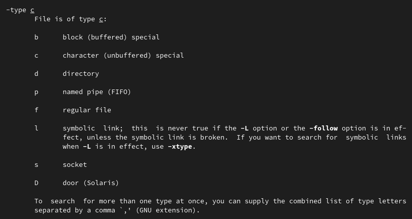{#fig:015 width=70%}

## Выполнение лабораторной работы

Командой find и опцией -type d нахожу все директории в домашнем катологе.

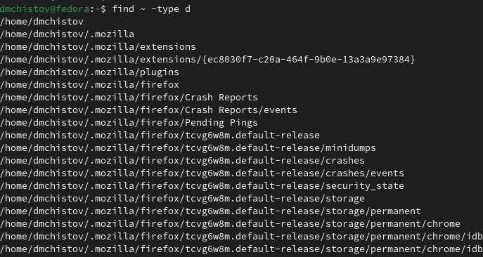{#fig:016 width=70%}

# Выводы

В результате выполненения данной работы я ознакомился с инструментами поиска файлов и фильтрации текстовых данных. Приобрёл практические навыки: по управлению процессами (и заданиями), по проверке использования диска и обслуживанию файловых систем.

# Список литературы{.unnumbered}

[Лабораторная работы №8](https://esystem.rudn.ru/pluginfile.php/2288089/mod_resource/content/4/006-lab_proc.pdf)

