---
## Front matter
title: "Отчёт по лабораторной работе №8"
subtitle: "Операционные системы"
author: "Чистов Даниил Максимович"

## Generic otions
lang: ru-RU
toc-title: "Содержание"

## Bibliography
bibliography: bib/cite.bib
csl: pandoc/csl/gost-r-7-0-5-2008-numeric.csl

## Pdf output format
toc: true # Table of contents
toc-depth: 2
lof: true # List of figures
lot: false # List of tables
fontsize: 12pt
linestretch: 1.5
papersize: a4
documentclass: scrreprt
## I18n polyglossia
polyglossia-lang:
  name: russian
  options:
	- spelling=modern
	- babelshorthands=true
polyglossia-otherlangs:
  name: english
## I18n babel
babel-lang: russian
babel-otherlangs: english
## Fonts
mainfont: Liberation Serif
romanfont: Liberation Serif
sansfont: Liberation Serif
monofont: Liberation Serif
mainfontoptions: Ligatures=TeX
romanfontoptions: Ligatures=TeX
sansfontoptions: Ligatures=TeX,Scale=MatchLowercase
monofontoptions: Scale=MatchLowercase,Scale=0.9
## Biblatex
biblatex: true
biblio-style: "gost-numeric"
biblatexoptions:
  - parentracker=true
  - backend=biber
  - hyperref=auto
  - language=auto
  - autolang=other*
  - citestyle=gost-numeric
## Pandoc-crossref LaTeX customization
figureTitle: "Рис."
tableTitle: "Таблица"
listingTitle: "Листинг"
lofTitle: "Список иллюстраций"
lotTitle: "Список таблиц"
lolTitle: "Листинги"
## Misc options
indent: true
header-includes:
  - \usepackage{indentfirst}
  - \usepackage{float} # keep figures where there are in the text
  - \floatplacement{figure}{H} # keep figures where there are in the text
---

# Цель работы

Целью данной работы является ознакомление с инструментами поиска файлов и фильтрации текстовых данных. Приобретение практических навыков: по управлению процессами (и заданиями), по проверке использования диска и обслуживанию файловых систем.

# Задание

Выполнить поставленный набор заданий

# Выполнение лабораторной работы

Приступлю к выполнению работы - вхожу в систему под своим логином и паролём. Нужно записать в file.txt названия файлов, содержащихся в каталоге /etc. Символом ">" перевожу вывод команлы ls -lR /etc в file.txt, который автоматически будет создан. Проверяю (рис. [-@fig:001]).

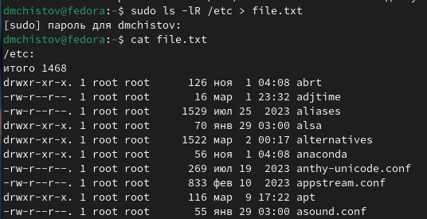{#fig:001 width=70%}

Теперь  в этот же файл мне нужно добавить названия файлов, содержащихся в вашем домашнем каталоге. Принцип такой же, только вместо ">" пишу ">>", чтобы войти в режим добавления (рис. [-@fig:002]).

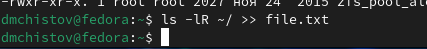{#fig:002 width=70%}

Вывожу имена всех файлов из file.txt, имеющих расширение .conf с помощью утилиты grep (рис. [-@fig:003]).

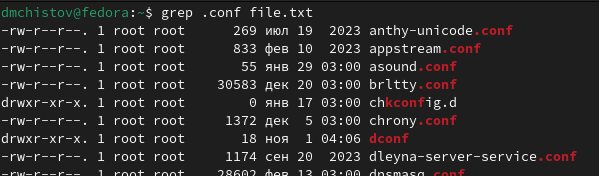{#fig:003 width=70%}

Теперь по похожу принципу из прошлых задач, записываю вывод из прошлой команды в файл conf.txt (рис. [-@fig:004]).

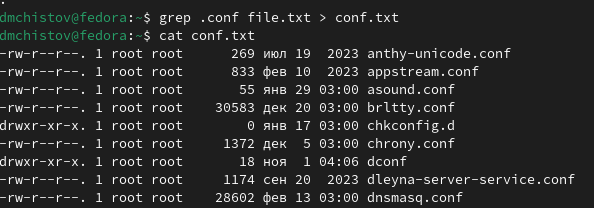{#fig:004 width=70%}

Нужно найти все каталоги в домашней папке, начинающиеся на "c". Это можно сделать несколькими способами. Первый - утилитой find (рис. [-@fig:005]).

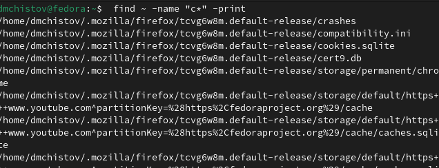{#fig:005 width=70%}

Второй способ - воспользоваться конвеером и утилитой grep (рис. [-@fig:006]).

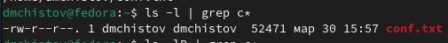{#fig:006 width=70%}

Вывожу имена файлов из каталога /etc, начинающиеся с символа h (рис. [-@fig:007]).

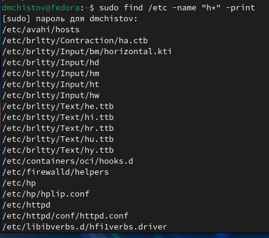{#fig:007 width=70%}

Запускаю процесс в фоновом режиме, добавив символ & в конец команды. Процесс будет записывать в файл ~/logfile файлы, имена которых начинаются с log (рис. [-@fig:008]).

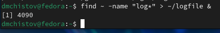{#fig:008 width=70%}

Теперь завершаю процесс, удалив файл logfile (рис. [-@fig:009]).

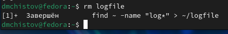{#fig:009 width=70%}

Запускаю в фоновом режиме редактор gedit (рис. [-@fig:010]).

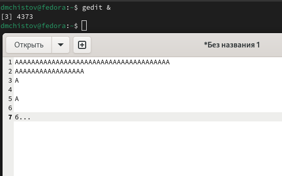{#fig:010 width=70%}

С помошью конвеера и grep нахожу ID запущенного процесса gedit (рис. [-@fig:011]).

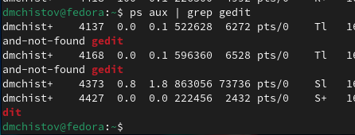{#fig:011 width=70%}

С помошью конвеера и grep нахожу ID запущенного процесса gedit (рис. [-@fig:012]).

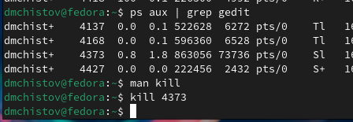{#fig:012 width=70%}

Командой df узнаю размер выбранной мной файловой системы (рис. [-@fig:013]).

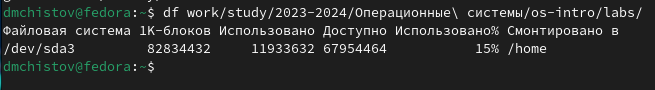{#fig:013 width=70%}

Командой du и опцией -h ("по человечески") узнаю размер директорий выбранной мной файловой системы (рис. [-@fig:014]).

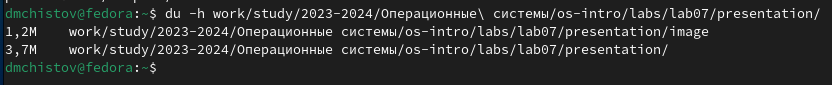{#fig:014 width=70%}

Командой man изучаю команду find и обнаруживаю опцию -type, которая позволяет выбрать тип файлов, который нужно найти (рис. [-@fig:015]).

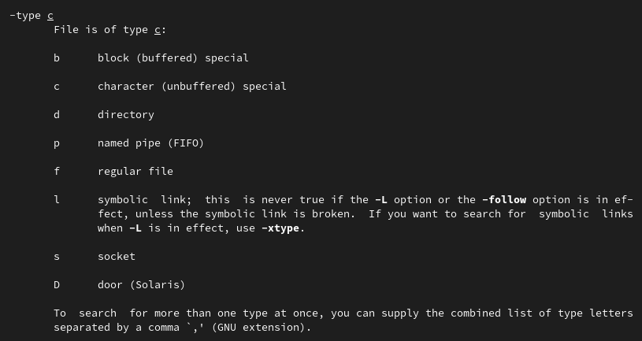{#fig:015 width=70%}

Командой find и опцией -type d нахожу все директории в домашнем катологе (рис. [-@fig:016]).

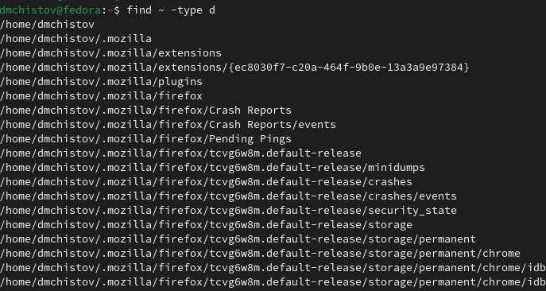{#fig:016 width=70%}

# Выводы

В результате выполненения данной работы я ознакомился с инструментами поиска файлов и фильтрации текстовых данных. Приобрёл практические навыки: по управлению процессами (и заданиями), по проверке использования диска и обслуживанию файловых систем.

# Список литературы{.unnumbered}

[Лабораторная работы №8](https://esystem.rudn.ru/pluginfile.php/2288089/mod_resource/content/4/006-lab_proc.pdf)
