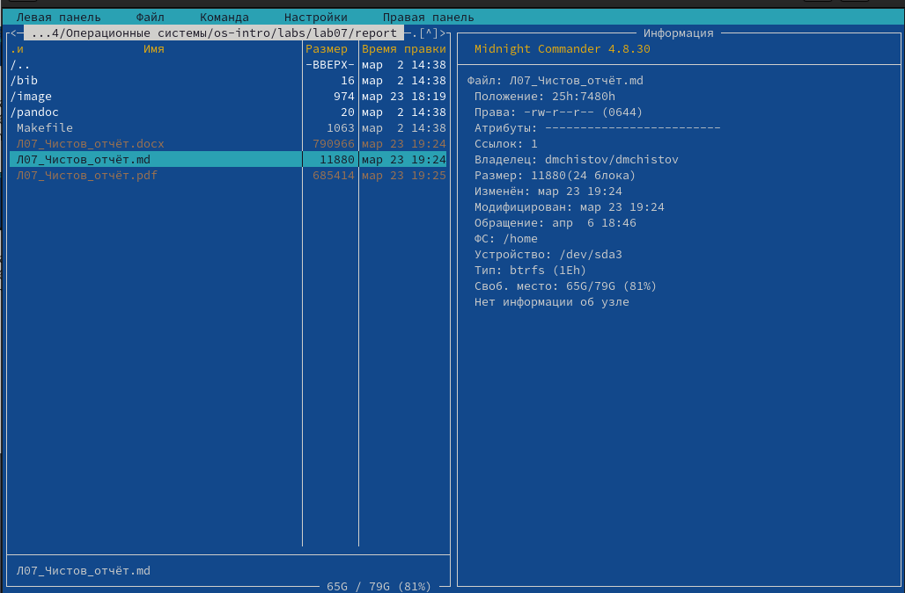
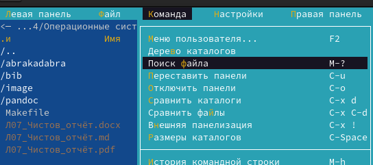
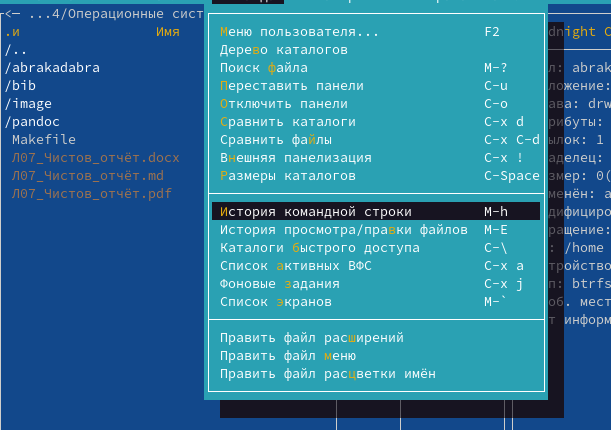

---
## Front matter
lang: ru-RU
title: Лабораторная работа №9
subtitle: Операционные системы
author:
  - Чистов Д. М.
institute:
  - Российский университет дружбы народов, Москва, Россия
date: 6 Апреля 2024

## i18n babel
babel-lang: russian
babel-otherlangs: english

## Formatting pdf
toc: false
toc-title: Содержание
slide_level: 2
aspectratio: 169
section-titles: true
theme: metropolis
header-includes:
 - \metroset{progressbar=frametitle,sectionpage=progressbar,numbering=fraction}
 - '\makeatletter'
 - '\beamer@ignorenonframefalse'
 - '\makeatother'

## Fonts
mainfont: Liberation Serif
romanfont: Liberation Serif
sansfont: Liberation Serif
monofont: Liberation Serif
mainfontoptions: Ligatures=TeX
romanfontoptions: Ligatures=TeX
---

# Вступительная информация

# Цель работы

Целью данной работы является освоение основных возможностей командной оболочки Midnight Commander. Приобретение навыков практической работы по просмотру каталогов и файлов; манипуляций с ними.

# Задание

1. Работа с Midnight Commander
2. Работа со встроенным редактором файлов в Midnight Commander

# Выполнение лабораторной работы

## 1. Работа с Midnight Commander

Приступаю к выполнению работы. Для начала изучу документацию к Midnight Commander с помощью команды man.

{#fig:001 width=70%}

## 1. Работа с Midnight Commander

Ввожу в консоль команду mc и попадаю в Midnight commander. От меня требуется поработать с файлами моей операционной системы, с помощью MC.

{#fig:002 width=70%}

## 1. Работа с Midnight Commander

Клавишами стрелками на клавиатуре передвигаюсь по катлогом, и выбираю папку play.

{#fig:003 width=70%}

## 1. Работа с Midnight Commander

Копирую каталог play в него самого.

{#fig:004 width=70%}

## 1. Работа с Midnight Commander

Папка успешно скопирована.

{#fig:005 width=70%}

## 1. Работа с Midnight Commander

В текущем каталоге создам папку.

{#fig:006 width=70%}

## 1. Работа с Midnight Commander

Папка успешно создана.

{#fig:007 width=70%}

## 1. Работа с Midnight Commander

Перемещаю file.old в домашнюю папку.

{#fig:008 width=70%}

## 1. Работа с Midnight Commander

Файл успешно перенесён.

{#fig:009 width=70%}

## 1. Работа с Midnight Commander

В подменю "Правая панель" выбираю "Краткий просмотр" и теперь в левой панели я могу выбирать файл, а в правой кратко на него посмотреть.

{#fig:010 width=70%}

## 1. Работа с Midnight Commander

Таким же образом я могу просмотреть особую информацию о файле, включая его положение, дату изменения, права и т.д.

{#fig:011 width=70%}

## 1. Работа с Midnight Commander

Используя возможности подменю "файл": просматриваю содержимое файла.

{#fig:012 width=70%}

## 1. Работа с Midnight Commander

Успешно просматриваю содержимое файла.

{#fig:013 width=70%}

## 1. Работа с Midnight Commander

Используя возможности подменю "файл": изменяю файл.

{#fig:014 width=70%}

## 1. Работа с Midnight Commander

Успешно изменяю файл.

{#fig:015 width=70%}

## 1. Работа с Midnight Commander

Также в меню "Файл" могу создать каталог.

{#fig:016 width=70%}

## 1. Работа с Midnight Commander

Каталог успешно создан.

{#fig:017 width=70%}

## 1. Работа с Midnight Commander

Требуется скопировать несколько файлов. Для начала правой кнопкой мыши выделю нужные мне файлы.

{#fig:018 width=70%}

## 1. Работа с Midnight Commander

В подменю "Файл" выбираю "копирование".

{#fig:019 width=70%}

## 1. Работа с Midnight Commander

Выбираю место, куда хочу скопировать файлы.

{#fig:020 width=70%}

## 1. Работа с Midnight Commander

Файлы успешно скопированы.

{#fig:021 width=70%}

## 1. Работа с Midnight Commander

С помощью возможностей меню "Команда": ищу нужный мне файл.

{#fig:022 width=70%}

## 1. Работа с Midnight Commander

Указываю .md в "содержимое".

{#fig:023 width=70%}

## 1. Работа с Midnight Commander

Файлы успешно найдены.

{#fig:024 width=70%}

## 1. Работа с Midnight Commander

Воспользуюсь историей командной строки.

{#fig:025 width=70%}

## 1. Работа с Midnight Commander

Анализирую файл расширений.

{#fig:026 width=70%}

## 1. Работа с Midnight Commander

Анализирую файл меню.

{#fig:027 width=70%}

## 1. Работа с Midnight Commander

В меню настройках могу, например, убрать мини-статус.

{#fig:028 width=70%}

## 1. Работа с Midnight Commander

Могу изменить расположение панелей в MC, выбрав "горизонатльное" в меню "Внешний вид".

{#fig:029 width=70%}

## 2. Работа со встроенным редактором файлов в Midnight Commander

Перехожу в папку, в меню пользователя выбираю сделать что-то в текущем файле (по сути в каталоге).

{#fig:030 width=70%}

## 2. Работа со встроенным редактором файлов в Midnight Commander

Ввожу команду для создания файла.

{#fig:031 width=70%}

## 2. Работа со встроенным редактором файлов в Midnight Commander

Файл успешно создан.

{#fig:032 width=70%}

## 2. Работа со встроенным редактором файлов в Midnight Commander

Перехожу в него, вставляю текст из pdf файла Лаборторной работы №9.

{#fig:033 width=70%}

## 2. Работа со встроенным редактором файлов в Midnight Commander

Удаляю строку в тексте с помощью ctrl+y.

{#fig:034 width=70%}

## 2. Работа со встроенным редактором файлов в Midnight Commander

Нужно скопировать текст. Выделю нужный текст.

{#fig:035 width=70%}

## 2. Работа со встроенным редактором файлов в Midnight Commander

Горячими клавишами вставляю текст на новую строку.

{#fig:036 width=70%}

## 2. Работа со встроенным редактором файлов в Midnight Commander

Нужно переместить текст на дргугю строку. Выделяю текст.

{#fig:037 width=70%}

## 2. Работа со встроенным редактором файлов в Midnight Commander

Перемещаю текст.

{#fig:038 width=70%}

## 2. Работа со встроенным редактором файлов в Midnight Commander

Сохраняю файл.

{#fig:039 width=70%}

## 2. Работа со встроенным редактором файлов в Midnight Commander

Отменяю предыдущее действие с помощью ctrl+u.

{#fig:040 width=70%}

## 2. Работа со встроенным редактором файлов в Midnight Commander

С помощью PgUP пермещаюсь в начало файла.

{#fig:041 width=70%}

## 2. Работа со встроенным редактором файлов в Midnight Commander

С помощью PgDOWN пермещаюсь в конец файла.

{#fig:042 width=70%}

## 2. Работа со встроенным редактором файлов в Midnight Commander

Открываю файл .md, чтобы у меня выделялся синтаксис Markdown.

{#fig:043 width=70%}

## 2. Работа со встроенным редактором файлов в Midnight Commander

Перехожу в настроке McEdit, выбираю "Цветовыделение синтаксиса".

{#fig:044 width=70%}

## 2. Работа со встроенным редактором файлов в Midnight Commander

Вижу, что сейчас выделяется синтаксис Markdown.

{#fig:045 width=70%}

## 2. Работа со встроенным редактором файлов в Midnight Commander

Изменяю его на Unknown, тогда синтаксис не должен выделяться.

{#fig:046 width=70%}

## 2. Работа со встроенным редактором файлов в Midnight Commander

Готово. Теперь я не могу разобраться в коде Markdown.

{#fig:047 width=70%}

# Выводы

В результате выполненения данной работы я освоил основные возможности командной оболочки Midnight Commander. Приобрёл навыки практической работы по просмотру каталогов и файлов; манипуляций с ними.

# Список литературы{.unnumbered}

[Лабораторная работы №9](https://esystem.rudn.ru/pluginfile.php/2288091/mod_resource/content/5/007-lab_mc.pdf)

