---
## Front matter
lang: ru-RU
title: Лабораторная работа №10
subtitle: Операционные системы
author:
  - Чистов Д. М.
institute:
  - Российский университет дружбы народов, Москва, Россия
date: 12 Апреля 2024

## i18n babel
babel-lang: russian
babel-otherlangs: english

## Formatting pdf
toc: false
toc-title: Содержание
slide_level: 2
aspectratio: 169
section-titles: true
theme: metropolis
header-includes:
 - \metroset{progressbar=frametitle,sectionpage=progressbar,numbering=fraction}
 - '\makeatletter'
 - '\beamer@ignorenonframefalse'
 - '\makeatother'

## Fonts
mainfont: Liberation Serif
romanfont: Liberation Serif
sansfont: Liberation Serif
monofont: Liberation Serif
mainfontoptions: Ligatures=TeX
romanfontoptions: Ligatures=TeX
---

# Вступительная информация

# Цель работы

Целью данной работы является ознакомление с операционной системой Linux. Получение практических навыков работы с редактором vi, установленным по умолчанию практически во всех дистрибутивах.

# Задание

1. Создание нового файла с использованием vi
2. Редактирование существующего файла

# Выполнение лабораторной работы

## 1. Создание нового файла с использованием vi

Приступаю к выполнению работы. Для начала изучу документацию к vi, а затем по заданию создам каталог lab06.

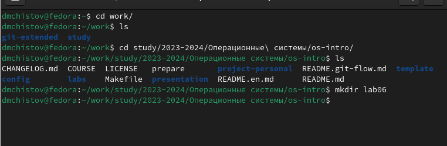{#fig:001 width=70%}

## 1. Создание нового файла с использованием vi

Перехожу в созданный каталог, прописываю команду vi hello.sh, которая создаст файл, с которым мне нужно работать. Эта команда сразу откроет этот файл для начала работы с ним. Запишу в него нужный текст по заданию.

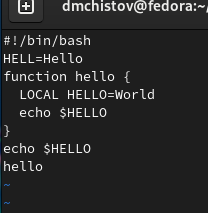{#fig:002 width=70%}

## 1. Создание нового файла с использованием vi

Нажимаю esc для перехода в командный режим, нажимаю : для перехода в режим последней строки, затем пишу w для сохранения информации, q для выхода, после чего нажму enter.

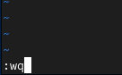{#fig:003 width=70%}

## 1. Создание нового файла с использованием vi

Делаю файл выполняемым, прописав команду chmod +x hello.sh.

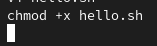{#fig:004 width=70%}

# 2. Редактирование существующего файла

По заданию, открываю файл заново. Вот как он выглядит до изменений.

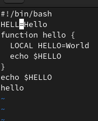{#fig:005 width=70%}

## 2. Редактирование существующего файла

Нажимаю a, чтобы перейти в режим вставки после курсора, и добавляю нужный текст. Затем нажимаю esc.

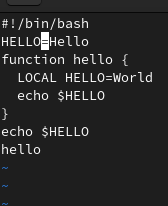{#fig:006 width=70%}

## 2. Редактирование существующего файла

Устанавливаю курсор на 4-ую строку после слова LOCAL, затем перехожу в режим редактирования и стираю это слово. Потом пишу новое слово.

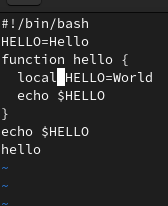{#fig:007 width=70%}

## 2. Редактирование существующего файла

Перехожу на последнюю строку, затем перехожу в режим вставки и пишу текст echo $HELLO.

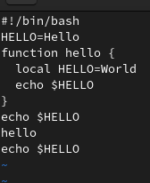{#fig:008 width=70%}

## 2. Редактирование существующего файла

Перехожу обратно в командный режим, перехожу на последнюю строку, нажимаю два раза d, чтобы удалить строку.

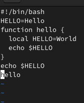{#fig:009 width=70%}

## 2. Редактирование существующего файла

Нажимаю клавишу u, чтобы отменить последнее действие.

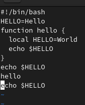{#fig:010 width=70%}

## 2. Редактирование существующего файла

Перехожу в командный режим, нажимаю : для перехода в режим последней строки, затем пишу w для сохранения информации, q для выхода, после чего нажму enter.

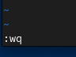{#fig:011 width=70%}

# Выводы

В результате выполненения данной работы я ознакомился с операционной системой Linux. Получил практические навыки работы с редактором vi

# Список литературы{.unnumbered}

[Лабораторная работы №10](https://esystem.rudn.ru/pluginfile.php/2288093/mod_resource/content/4/008-lab_vi.pdf)

