---
## Front matter
title: "Отчёт по лабораторной работе №10"
subtitle: "Операционные системы"
author: "Чистов Даниил Максимович"

## Generic otions
lang: ru-RU
toc-title: "Содержание"

## Bibliography
bibliography: bib/cite.bib
csl: pandoc/csl/gost-r-7-0-5-2008-numeric.csl

## Pdf output format
toc: true # Table of contents
toc-depth: 2
lof: true # List of figures
lot: false # List of tables
fontsize: 12pt
linestretch: 1.5
papersize: a4
documentclass: scrreprt
## I18n polyglossia
polyglossia-lang:
  name: russian
  options:
	- spelling=modern
	- babelshorthands=true
polyglossia-otherlangs:
  name: english
## I18n babel
babel-lang: russian
babel-otherlangs: english
## Fonts
mainfont: Liberation Serif
romanfont: Liberation Serif
sansfont: Liberation Serif
monofont: Liberation Serif
mainfontoptions: Ligatures=TeX
romanfontoptions: Ligatures=TeX
sansfontoptions: Ligatures=TeX,Scale=MatchLowercase
monofontoptions: Scale=MatchLowercase,Scale=0.9
## Biblatex
biblatex: true
biblio-style: "gost-numeric"
biblatexoptions:
  - parentracker=true
  - backend=biber
  - hyperref=auto
  - language=auto
  - autolang=other*
  - citestyle=gost-numeric
## Pandoc-crossref LaTeX customization
figureTitle: "Рис."
tableTitle: "Таблица"
listingTitle: "Листинг"
lofTitle: "Список иллюстраций"
lotTitle: "Список таблиц"
lolTitle: "Листинги"
## Misc options
indent: true
header-includes:
  - \usepackage{indentfirst}
  - \usepackage{float} # keep figures where there are in the text
  - \floatplacement{figure}{H} # keep figures where there are in the text
---

# Цель работы

Целью данной работы является ознакомление с операционной системой Linux. Получение практических навыков работы с редактором vi, установленным по умолчанию практически во всех дистрибутивах.

# Задание

1. Создание нового файла с использованием vi
2. Редактирование существующего файла

# Выполнение лабораторной работы\

## 1. Создание нового файла с использованием vi

Приступаю к выполнению работы. Для начала изучу документацию к vi, а затем по заданию создам каталог lab06 (рис. [-@fig:001]).

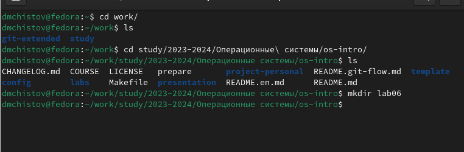{#fig:001 width=70%}

Перехожу в созданный каталог, прописываю команду vi hello.sh, которая создаст файл, с которым мне нужно работать. Эта команда сразу откроет этот файл для начала работы с ним. Запишу в него нужный текст по заданию (рис. [-@fig:002]).

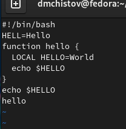{#fig:002 width=70%}

Нажимаю esc для перехода в командный режим, нажимаю : для перехода в режим последней строки, затем пишу w для сохранения информации, q для выхода, после чего нажму enter (рис. [-@fig:003]).

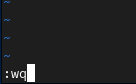{#fig:003 width=70%}

Делаю файл выполняемым, прописав команду chmod +x hello.sh (рис. [-@fig:004]).

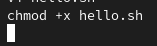{#fig:004 width=70%}

## 2. Редактирование существующего файла

По заданию, открываю файл заново. Вот как он выглядит до изменений (рис. [-@fig:005]).

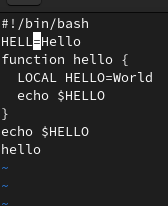{#fig:005 width=70%}

Нажимаю a, чтобы перейти в режим вставки после курсора, и добавляю нужный текст. Затем нажимаю esc (рис. [-@fig:006]).

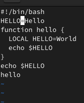{#fig:006 width=70%}

Устанавливаю курсор на 4-ую строку после слова LOCAL, затем перехожу в режим редактирования и стираю это слово. Потом пишу новое слово (рис. [-@fig:007]).

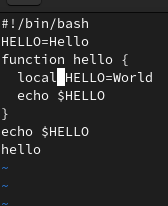{#fig:007 width=70%}

Перехожу на последнюю строку, затем перехожу в режим вставки и пишу текст echo $HELLO (рис. [-@fig:008]).

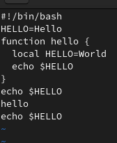{#fig:008 width=70%}

Перехожу обратно в командный режим, перехожу на последнюю строку, нажимаю два раза d, чтобы удалить строку (рис. [-@fig:009]).

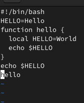{#fig:009 width=70%}

Нажимаю клавишу u, чтобы отменить последнее действие (рис. [-@fig:010]).

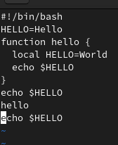{#fig:010 width=70%}

Перехожу в командный режим, нажимаю : для перехода в режим последней строки, затем пишу w для сохранения информации, q для выхода, после чего нажму enter (рис. [-@fig:011]).

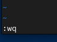{#fig:011 width=70%}

# Выводы

В результате выполненения данной работы я ознакомился с операционной системой Linux. Получил практические навыки работы с редактором vi

# Список литературы{.unnumbered}

[Лабораторная работы №10](https://esystem.rudn.ru/pluginfile.php/2288093/mod_resource/content/4/008-lab_vi.pdf)
