---
## Front matter
lang: ru-RU
title: Лабораторная работа №11
subtitle: Операционные системы
author:
  - Чистов Д. М.
institute:
  - Российский университет дружбы народов, Москва, Россия
date: 20 Апреля 2024

## i18n babel
babel-lang: russian
babel-otherlangs: english

## Formatting pdf
toc: false
toc-title: Содержание
slide_level: 2
aspectratio: 169
section-titles: true
theme: metropolis
header-includes:
 - \metroset{progressbar=frametitle,sectionpage=progressbar,numbering=fraction}
 - '\makeatletter'
 - '\beamer@ignorenonframefalse'
 - '\makeatother'

## Fonts
mainfont: Liberation Serif
romanfont: Liberation Serif
sansfont: Liberation Serif
monofont: Liberation Serif
mainfontoptions: Ligatures=TeX
romanfontoptions: Ligatures=TeX
---

# Вступительная информация

# Цель работы

Познакомиться с операционной системой Linux. Получать практические навыки работы с редактором Emacs.

## Выполнение лабораторной работы

Приступаю к выполнению работы. Для начала изучу документацию к emacs, а затем открою данную утилиту.

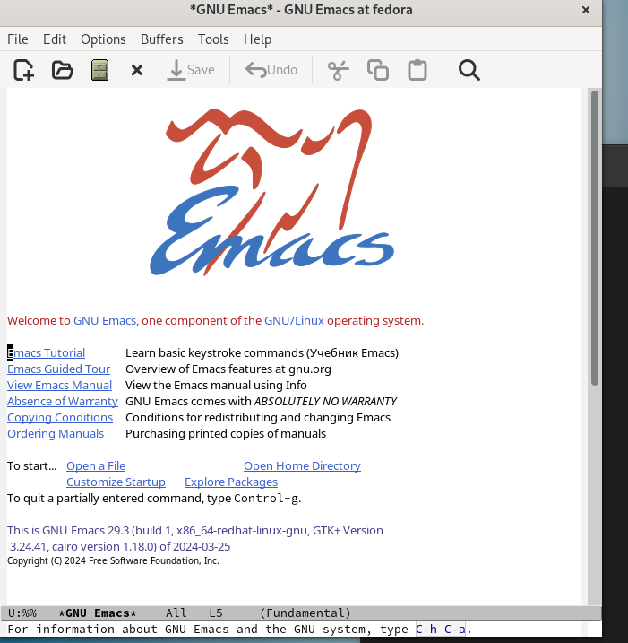{#fig:001 width=70%}

## Выполнение лабораторной работы

Создаю файл комбинацией клавиш, а затем вписываю в него текст по заданию.

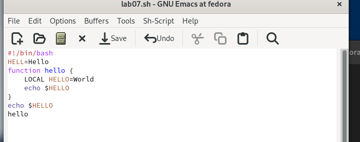{#fig:002 width=70%}

## Выполнение лабораторной работы

Сохраняю файл и по заданию: вырезаю одной командой целую строку.

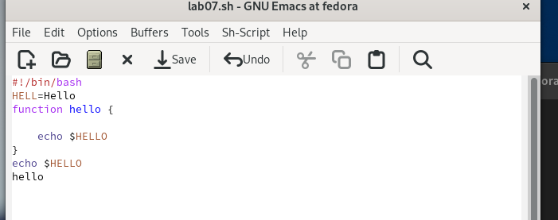{#fig:003 width=70%}

## Выполнение лабораторной работы

Вставляю эту строку в конец файла.

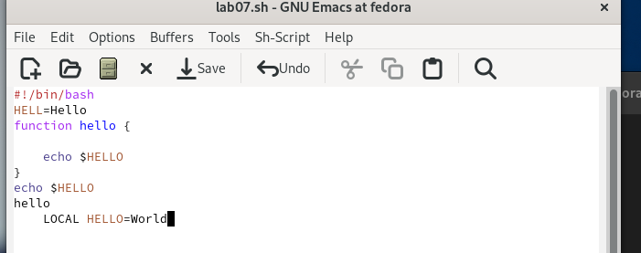{#fig:004 width=70%}

## Выполнение лабораторной работы

Выделяю область текста (C-space) и копирую её в буфер обмена (M-w).

{#fig:004 width=70%}

## Выполнение лабораторной работы

затем вставляю её в конец файла.

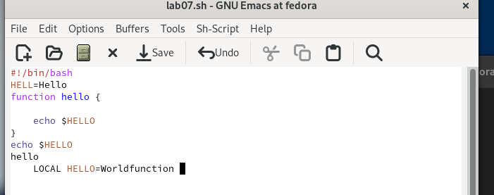{#fig:005 width=70%}

## Выполнение лабораторной работы

Перемещаю курсор в начало строки.

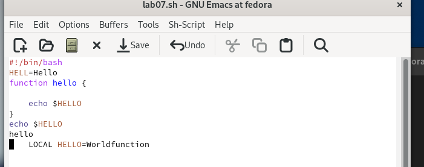{#fig:006 width=70%}

## Выполнение лабораторной работы

Перемещаю курсор в конец строки.

{#fig:007 width=70%}

## Выполнение лабораторной работы

Перемещаю курсор в начало буфера.

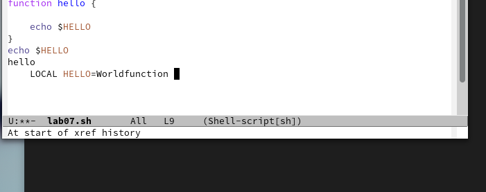{#fig:008 width=70%}

## Выполнение лабораторной работы

Перемещаю курсор в конец буфера.

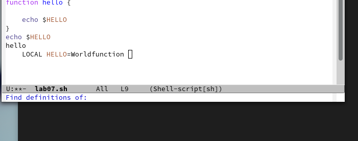{#fig:009 width=70%}

## Выполнение лабораторной работы

Вывожу список активных буферов на экран.

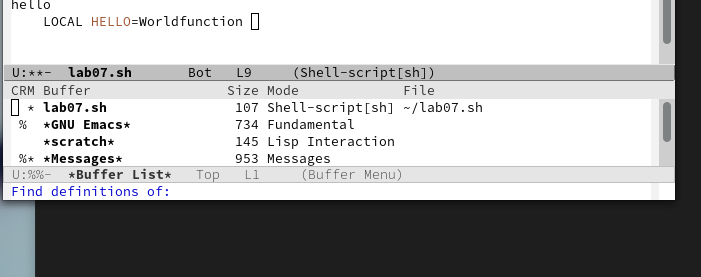{#fig:010 width=70%}

## Выполнение лабораторной работы

Переключаюсь на другой буфер - scratches.

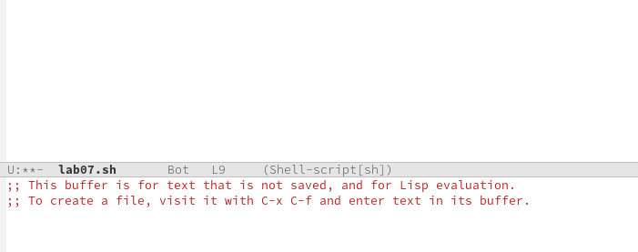{#fig:011 width=70%}

## Выполнение лабораторной работы

Закрываю окно и пробую переключиться на буфер другим способом ctrl-x + b.

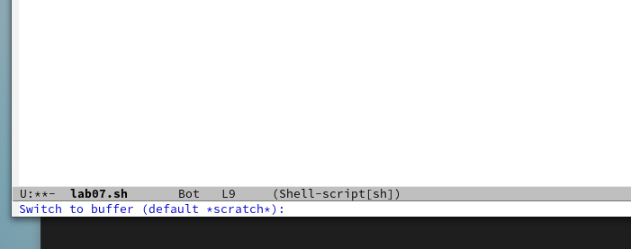{#fig:012 width=70%}

## Выполнение лабораторной работы

Поделю окно на 4 части: разделю фрейм на два окна по вертикали (C-x 3), а затем каждое из этих окон на две части по горизонтали (C-x 2).

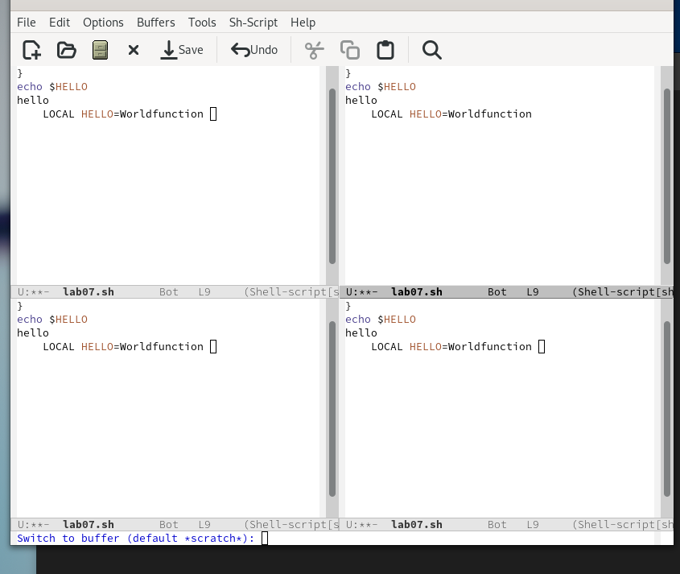{#fig:013 width=70%}

## Выполнение лабораторной работы

В каждом окне открою свой буфер.

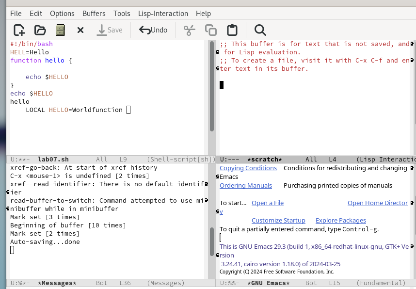{#fig:014 width=70%}

## Выполнение лабораторной работы

Воспользуюсь поиском файлов - найду все слова Hello.

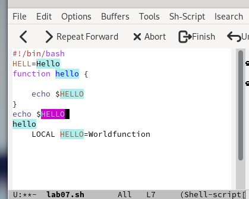{#fig:015 width=70%}

## Выполнение лабораторной работы

Воспользуюсь другим способом поиска.

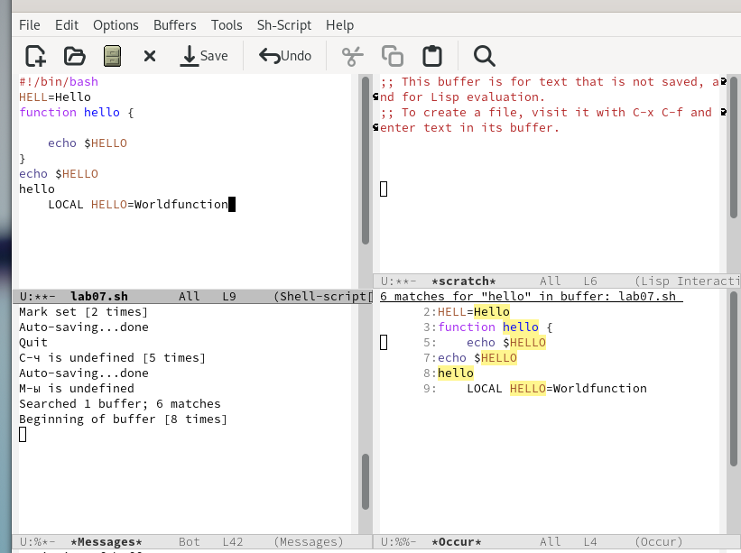{#fig:016 width=70%}

# Выводы

В результате выполненения данной работы я познакомился с операционной системой Linux. Получил практические навыки работы с редактором Emacs.

# Список литературы{.unnumbered}

[Лабораторная работы №11](/home/dmchistov/work/study/2023-2024/Операционные системы/os-intro/labs/lab10/report/Л10_Чистов_отчёт.md)

