---
## Front matter
title: "Отчёт по лабораторной работе №11"
subtitle: "Операционные системы"
author: "Чистов Даниил Максимович"

## Generic otions
lang: ru-RU
toc-title: "Содержание"

## Bibliography
bibliography: bib/cite.bib
csl: pandoc/csl/gost-r-7-0-5-2008-numeric.csl

## Pdf output format
toc: true # Table of contents
toc-depth: 2
lof: true # List of figures
lot: false # List of tables
fontsize: 12pt
linestretch: 1.5
papersize: a4
documentclass: scrreprt
## I18n polyglossia
polyglossia-lang:
  name: russian
  options:
	- spelling=modern
	- babelshorthands=true
polyglossia-otherlangs:
  name: english
## I18n babel
babel-lang: russian
babel-otherlangs: english
## Fonts
mainfont: Liberation Serif
romanfont: Liberation Serif
sansfont: Liberation Serif
monofont: Liberation Serif
mainfontoptions: Ligatures=TeX
romanfontoptions: Ligatures=TeX
sansfontoptions: Ligatures=TeX,Scale=MatchLowercase
monofontoptions: Scale=MatchLowercase,Scale=0.9
## Biblatex
biblatex: true
biblio-style: "gost-numeric"
biblatexoptions:
  - parentracker=true
  - backend=biber
  - hyperref=auto
  - language=auto
  - autolang=other*
  - citestyle=gost-numeric
## Pandoc-crossref LaTeX customization
figureTitle: "Рис."
tableTitle: "Таблица"
listingTitle: "Листинг"
lofTitle: "Список иллюстраций"
lotTitle: "Список таблиц"
lolTitle: "Листинги"
## Misc options
indent: true
header-includes:
  - \usepackage{indentfirst}
  - \usepackage{float} # keep figures where there are in the text
  - \floatplacement{figure}{H} # keep figures where there are in the text
---

# Цель работы

Познакомиться с операционной системой Linux. Получать практические навыки работы с редактором Emacs.

# Выполнение лабораторной работы\

Приступаю к выполнению работы. Для начала изучу документацию к emacs, а затем открою данную утилиту (рис. [-@fig:001]).

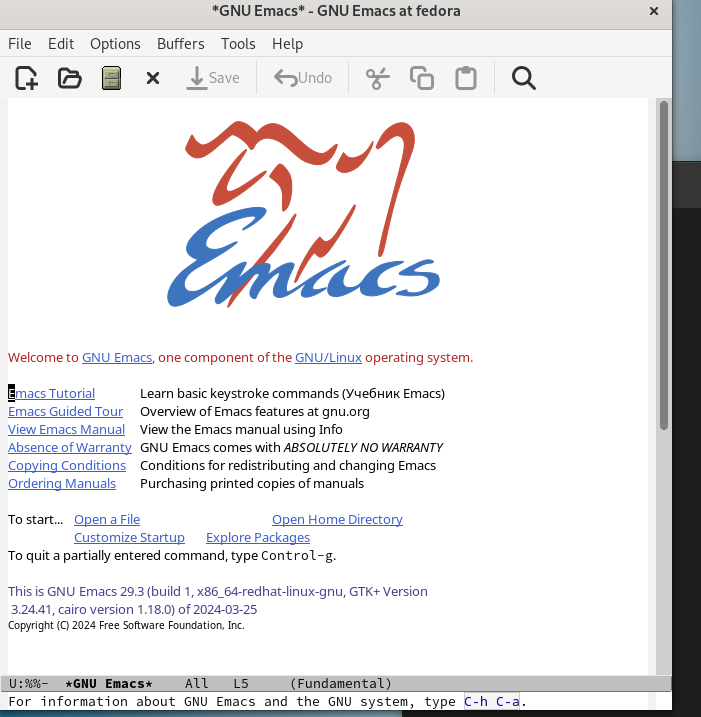{#fig:001 width=70%}

Создаю файл комбинацией клавиш, а затем вписываю в него текст по заданию (рис. [-@fig:002]).

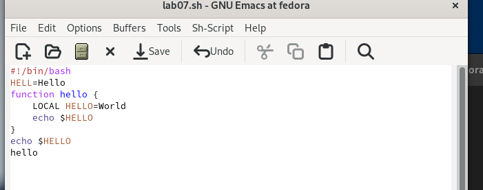{#fig:002 width=70%}

Сохраняю файл и по заданию: вырезаю одной командой целую строку (рис. [-@fig:003]).

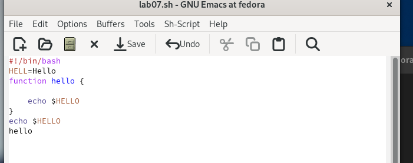{#fig:003 width=70%}

Вставляю эту строку в конец файла (рис. [-@fig:004]).

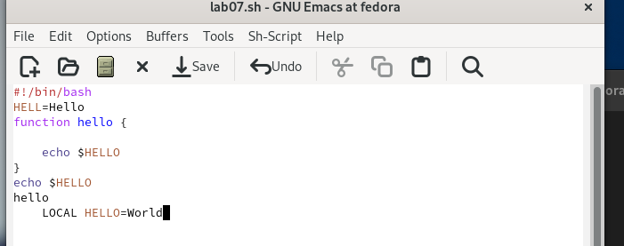{#fig:004 width=70%}

затем вставляю её в конец файла (рис. [-@fig:005]).

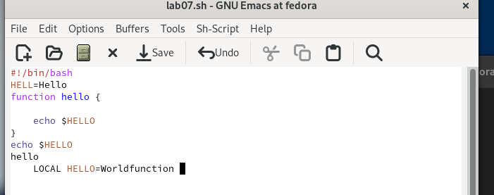{#fig:005 width=70%}

Перемещаю курсор в начало строки (рис. [-@fig:006]).

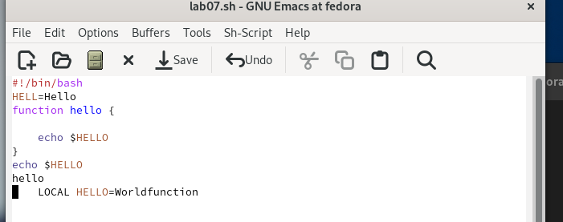{#fig:006 width=70%}

Перемещаю курсор в конец строки (рис. [-@fig:007]).

{#fig:007 width=70%}

Перемещаю курсор в начало буфера (рис. [-@fig:008]).

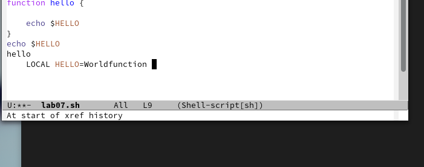{#fig:008 width=70%}

Перемещаю курсор в конец буфера (рис. [-@fig:009]).

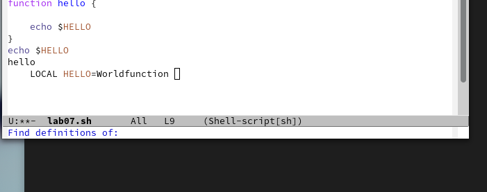{#fig:009 width=70%}

Вывожу список активных буферов на экран (рис. [-@fig:010]).

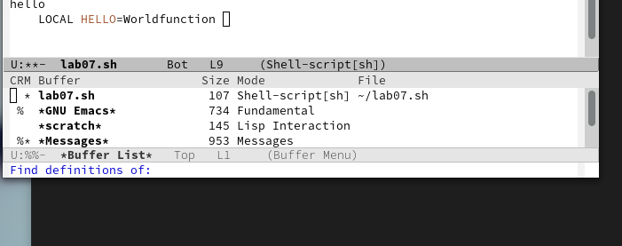{#fig:010 width=70%}

Переключаюсь на другой буфер - scratches (рис. [-@fig:011]).

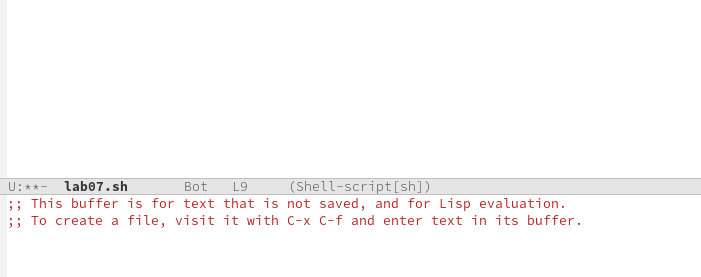{#fig:011 width=70%}

Закрываю окно и пробую переключиться на буфер другим способом ctrl-x + b (рис. [-@fig:012]).

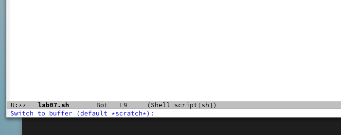{#fig:012 width=70%}

Поделю окно на 4 части: разделю фрейм на два окна по вертикали (C-x 3), а затем каждое из этих окон на две части по горизонтали (C-x 2) (рис. [-@fig:013]).

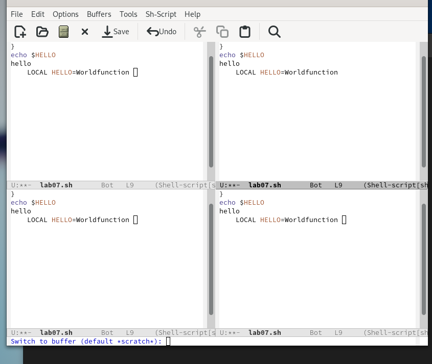{#fig:013 width=70%}

В каждом окне открою свой буфер (рис. [-@fig:014]).

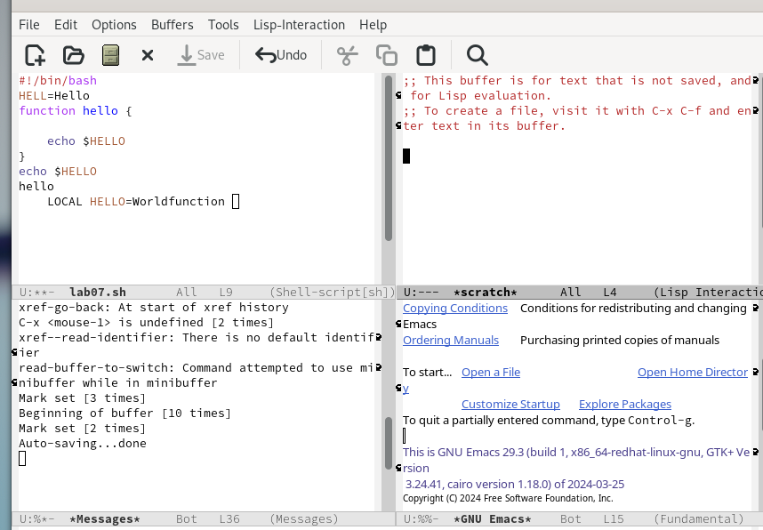{#fig:014 width=70%}

Воспользуюсь поиском файлов - найду все слова Hello (рис. [-@fig:015]).

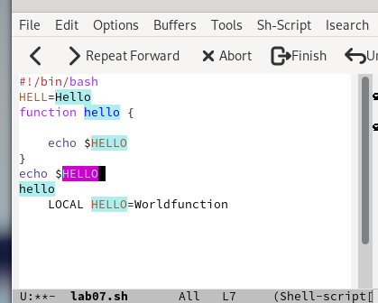{#fig:015 width=70%}

Воспользуюсь другим способом поиска (рис. [-@fig:016]).

{#fig:016 width=70%}

# Выводы

В результате выполненения данной работы я познакомился с операционной системой Linux. Получил практические навыки работы с редактором Emacs.

# Список литературы{.unnumbered}

[Лабораторная работы №11](/home/dmchistov/work/study/2023-2024/Операционные системы/os-intro/labs/lab10/report/Л10_Чистов_отчёт.md)
