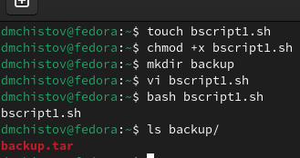
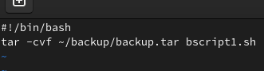
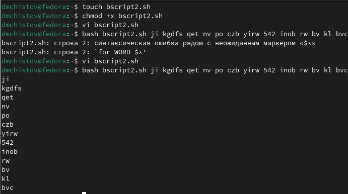
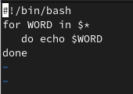
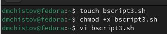
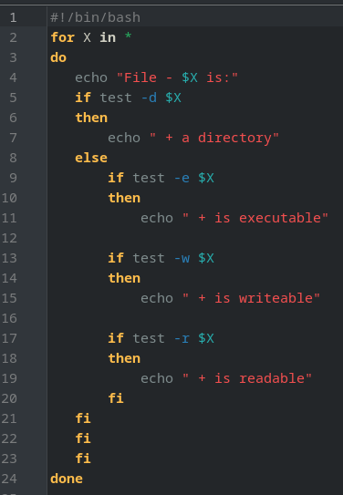
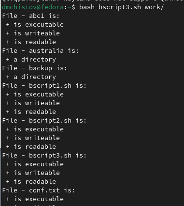
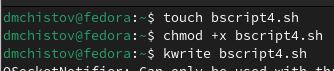
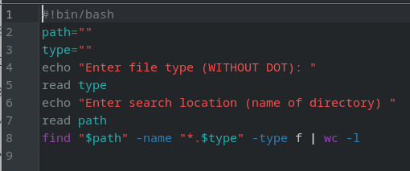
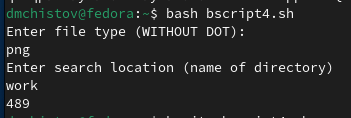

---
## Front matter
lang: ru-RU
title: Лабораторная работа №12
subtitle: Операционные системы
author:
  - Чистов Д. М.
institute:
  - Российский университет дружбы народов, Москва, Россия
date: 27 Апреля 2024

## i18n babel
babel-lang: russian
babel-otherlangs: english

## Formatting pdf
toc: false
toc-title: Содержание
slide_level: 2
aspectratio: 169
section-titles: true
theme: metropolis
header-includes:
 - \metroset{progressbar=frametitle,sectionpage=progressbar,numbering=fraction}
 - '\makeatletter'
 - '\beamer@ignorenonframefalse'
 - '\makeatother'

## Fonts
mainfont: Liberation Serif
romanfont: Liberation Serif
sansfont: Liberation Serif
monofont: Liberation Serif
mainfontoptions: Ligatures=TeX
romanfontoptions: Ligatures=TeX
---

# Вступительная информация

# Цель работы

Изучить основы программирования в оболочке ОС UNIX/Linux. Научиться писать небольшие командные файлы.

# Задания

1. Программа 1
2. Программа 2
3. Программа 3
4. Программа 4

# Выполнение лабораторной работы

# Программа 1

Задание: "Написать скрипт, который при запуске будет делать резервную копию самого себя (то есть файла, в котором содержится его исходный код) в другую директорию backup в вашем домашнем каталоге. При этом файл должен архивироваться одним из ар хиваторов на выбор zip, bzip2 или tar. Способ использования команд архивации необходимо узнать, изучив справку."

## Программа 1

Приступаю к выполнению работы. Создаю файл с кодом, создаю папку, куда будет сохраняться архив. Пишу код (сама программа будет показана позже), выполняю - готово.

{#fig:001 width=70%}

## Программа 1

Код программы 1: утилитой tar задаю место, где будет архив, а затем, что нужно архивировать.

{#fig:002 width=70%}

# Программа 2

Задание: "Написать пример командного файла, обрабатывающего любое произвольное число аргументов командной строки, в том числе превышающее десять. Например, скрипт может последовательно распечатывать значения всех переданных аргументов."

## Программа 2

Приступаю к выполнению - создаю, даю права, пишу код, исправляю ошибки, запускаю - работает.

{#fig:003 width=70%}

## Программа 2

Код программы 2: Циклом for прохожусь по каждому поданному слову в строке, которая подаётся с запуском, и каждое это слово вывожу

{#fig:004 width=70%}

# Программа 3

Задание: "Написать командный файл — аналог команды ls (без использования самой этой ко манды и команды dir). Требуется, чтобы он выдавал информацию о нужном каталоге и выводил информацию о возможностях доступа к файлам этого каталога."

## Программа 3

Создаю файл, даю права, начинаю писать код.

{#fig:005 width=70%}

## Программа 3

Код программы 3: Подаю путь, утилитой test и её параметрами проверяю файл: выполняемый ли он, читаемый ли, доступный для записи, вывожу соответствующие строки по результатам.

{#fig:006 width=70%}

## Программа 3

Запускаю, всё работает.

{#fig:007 width=70%}

# Программа 4

Задание: "Написать командный файл, который получает в качестве аргумента командной строки формат файла (.txt, .doc, .jpg, .pdf и т.д.) и вычисляет количество таких файлов в указанной директории. Путь к директории также передаётся в виде аргумента ко мандной строки"

## Программа 4

Создаю файл, даю права, начинаю писать код.

{#fig:008 width=70%}

## Программа 4

Код программы 4: Задаю переменные места для поиска и тип файлов. Прошу записать тип файла без точки, затем считываю. Прошу записать место поиска, затем считываю. Утилитой find вписываю место поиска, критерий поиска (имя), тип файла, и указываю, что нужно найти именно файлы, а не например директории. Затем использую утилиту wc, чтобы подсчитать количество найденных файлов.

{#fig:009 width=70%}

## Программа 4

Запускаю, всё работает.

{#fig:010 width=70%}

# Выводы

В результате выполненения данной работы я изучил основы программирования в оболочке ОС UNIX/Linux. Научился писать небольшие командные файлы.

# Список литературы{.unnumbered}

[Лабораторная работы №12](https://esystem.rudn.ru/pluginfile.php/2288097/mod_resource/content/4/010-lab_shell_prog_1.pdf)
[Команда find](https://habr.com/ru/companies/alexhost/articles/525394/)

