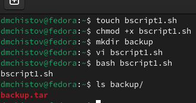
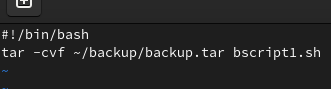
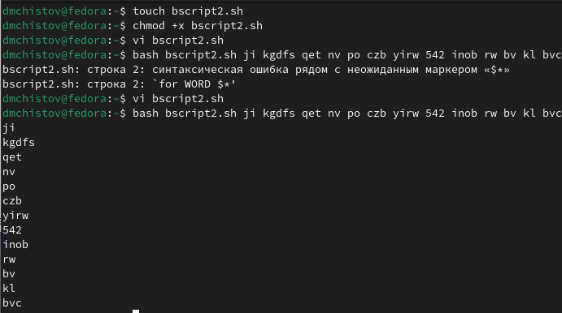
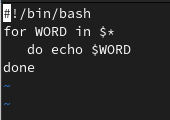
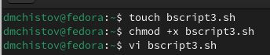
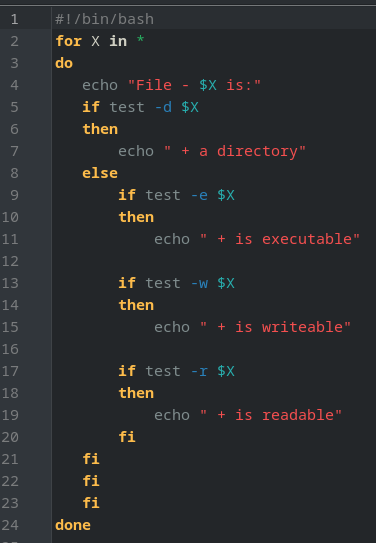
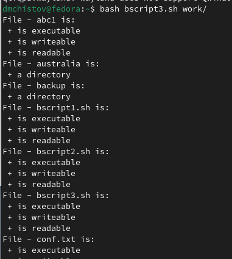
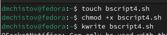
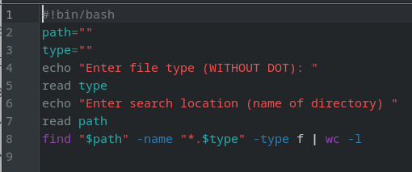
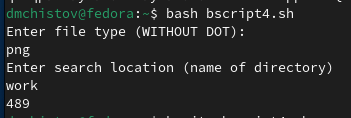

---
## Front matter
title: "Отчёт по лабораторной работе №12"
subtitle: "Операционные системы"
author: "Чистов Даниил Максимович"

## Generic otions
lang: ru-RU
toc-title: "Содержание"

## Bibliography
bibliography: bib/cite.bib
csl: pandoc/csl/gost-r-7-0-5-2008-numeric.csl

## Pdf output format
toc: true # Table of contents
toc-depth: 2
lof: true # List of figures
lot: false # List of tables
fontsize: 12pt
linestretch: 1.5
papersize: a4
documentclass: scrreprt
## I18n polyglossia
polyglossia-lang:
  name: russian
  options:
	- spelling=modern
	- babelshorthands=true
polyglossia-otherlangs:
  name: english
## I18n babel
babel-lang: russian
babel-otherlangs: english
## Fonts
mainfont: Liberation Serif
romanfont: Liberation Serif
sansfont: Liberation Serif
monofont: Liberation Serif
mainfontoptions: Ligatures=TeX
romanfontoptions: Ligatures=TeX
sansfontoptions: Ligatures=TeX,Scale=MatchLowercase
monofontoptions: Scale=MatchLowercase,Scale=0.9
## Biblatex
biblatex: true
biblio-style: "gost-numeric"
biblatexoptions:
  - parentracker=true
  - backend=biber
  - hyperref=auto
  - language=auto
  - autolang=other*
  - citestyle=gost-numeric
## Pandoc-crossref LaTeX customization
figureTitle: "Рис."
tableTitle: "Таблица"
listingTitle: "Листинг"
lofTitle: "Список иллюстраций"
lotTitle: "Список таблиц"
lolTitle: "Листинги"
## Misc options
indent: true
header-includes:
  - \usepackage{indentfirst}
  - \usepackage{float} # keep figures where there are in the text
  - \floatplacement{figure}{H} # keep figures where there are in the text
---

# Цель работы

Изучить основы программирования в оболочке ОС UNIX/Linux. Научиться писать небольшие командные файлы.

# Задания

1. Программа 1
2. Программа 2
3. Программа 3
4. Программа 4

# Выполнение лабораторной работы

# Программа 1

Задание: "Написать скрипт, который при запуске будет делать резервную копию самого себя (то есть файла, в котором содержится его исходный код) в другую директорию backup в вашем домашнем каталоге. При этом файл должен архивироваться одним из ар хиваторов на выбор zip, bzip2 или tar. Способ использования команд архивации необходимо узнать, изучив справку."

Приступаю к выполнению работы. Создаю файл с кодом, создаю папку, куда будет сохраняться архив. Пишу код (сама программа будет показана позже), выполняю - готово (рис. [-@fig:001]).

{#fig:001 width=70%}

Код программы 1: утилитой tar задаю место, где будет архив, а затем, что нужно архивировать (рис. [-@fig:002]).

{#fig:002 width=70%}

# Программа 2

Задание: "Написать пример командного файла, обрабатывающего любое произвольное число аргументов командной строки, в том числе превышающее десять. Например, скрипт может последовательно распечатывать значения всех переданных аргументов."

Приступаю к выполнению - создаю, даю права, пишу код, исправляю ошибки, запускаю - работает (рис. [-@fig:003]).

{#fig:003 width=70%}

Код программы 2: Циклом for прохожусь по каждому поданному слову в строке, которая подаётся с запуском, и каждое это слово вывожу (рис. [-@fig:004]).

{#fig:004 width=70%}

# Программа 3

Задание: "Написать командный файл — аналог команды ls (без использования самой этой ко манды и команды dir). Требуется, чтобы он выдавал информацию о нужном каталоге и выводил информацию о возможностях доступа к файлам этого каталога."

Создаю файл, даю права, начинаю писать код (рис. [-@fig:005]).

{#fig:005 width=70%}

Код программы 3: Подаю путь, утилитой test и её параметрами проверяю файл: выполняемый ли он, читаемый ли, доступный для записи, вывожу соответствующие строки по результатам (рис. [-@fig:006]).

{#fig:006 width=70%}

Запускаю, всё работает (рис. [-@fig:007]).

{#fig:007 width=70%}

# Программа 4

Задание: "Написать командный файл, который получает в качестве аргумента командной строки формат файла (.txt, .doc, .jpg, .pdf и т.д.) и вычисляет количество таких файлов в указанной директории. Путь к директории также передаётся в виде аргумента ко мандной строки"

Создаю файл, даю права, начинаю писать код (рис. [-@fig:008]).

{#fig:008 width=70%}

Код программы 4: Задаю переменные места для поиска и тип файлов. Прошу записать тип файла без точки, затем считываю. Прошу записать место поиска, затем считываю. Утилитой find вписываю место поиска, критерий поиска (имя), тип файла, и указываю, что нужно найти именно файлы, а не например директории. Затем использую утилиту wc, чтобы подсчитать количество найденных файлов (рис. [-@fig:009]).

{#fig:009 width=70%}

Запускаю, всё работает (рис. [-@fig:010]).

{#fig:010 width=70%}

# Выводы

В результате выполненения данной работы я изучил основы программирования в оболочке ОС UNIX/Linux. Научился писать небольшие командные файлы.

# Список литературы{.unnumbered}

[Лабораторная работы №12](https://esystem.rudn.ru/pluginfile.php/2288097/mod_resource/content/4/010-lab_shell_prog_1.pdf)
[Команда find](https://habr.com/ru/companies/alexhost/articles/525394/)
