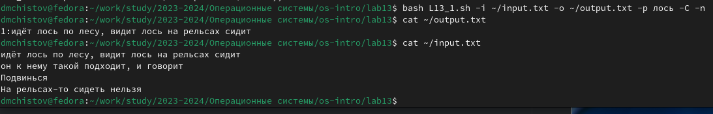
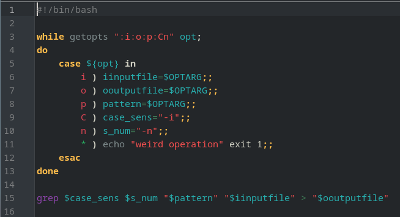
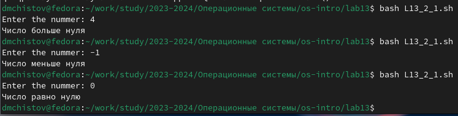
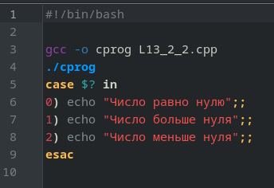
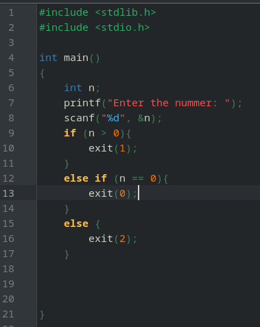
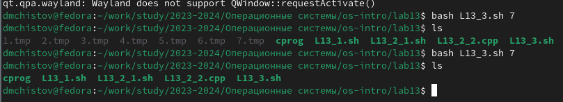
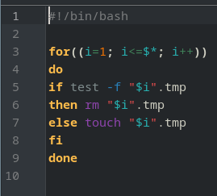
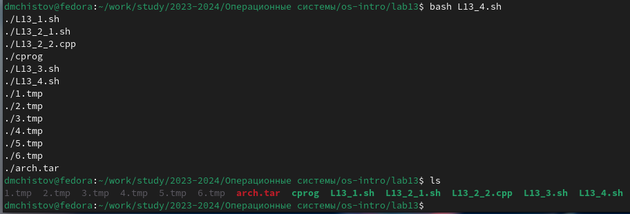
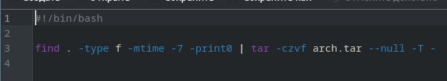

---
## Front matter
lang: ru-RU
title: Лабораторная работа №13
subtitle: Операционные системы
author:
  - Чистов Д. М.
institute:
  - Российский университет дружбы народов, Москва, Россия
date: 04 Мая 2024

## i18n babel
babel-lang: russian
babel-otherlangs: english

## Formatting pdf
toc: false
toc-title: Содержание
slide_level: 2
aspectratio: 169
section-titles: true
theme: metropolis
header-includes:
 - \metroset{progressbar=frametitle,sectionpage=progressbar,numbering=fraction}
 - '\makeatletter'
 - '\beamer@ignorenonframefalse'
 - '\makeatother'

## Fonts
mainfont: Liberation Serif
romanfont: Liberation Serif
sansfont: Liberation Serif
monofont: Liberation Serif
mainfontoptions: Ligatures=TeX
romanfontoptions: Ligatures=TeX
---

# Вступительная информация

# Цель работы

Изучить основы программирования в оболочке ОС UNIX/Linux. Научиться писать небольшие командные файлы.

# Задания

1. Программа 1
2. Программа 2
3. Программа 3
4. Программа 4

# Выполнение лабораторной работы

# Программа 1

Задание: "Используя команды getopts grep, написать командный файл, который анализирует командную строку с ключами: – -iinputfile — прочитать данные из указанного файла; – -ooutputfile — вывести данные в указанный файл; – -pшаблон — указать шаблон для поиска; – -C — различать большие и малые буквы; – -n — выдавать номера строк. а затем ищет в указанном файле нужные строки, определяемые ключом -p."

## Программа 1

Приступаю к выполнению работы. Создаю файл с кодом и пишу код (сама программа будет показана позже), выполняю - готово.

{#fig:001 width=70%}

## Программа 1

Код программы 1: утилитой getopts считываем коды, а дальше утититой case рассматриваем каждый случай. Затем утилитой grep считываем и используем output.txt.

{#fig:002 width=70%}

# Программа 2

Задание: "Написать на языке Си программу, которая вводит число и определяет, является ли оно больше нуля, меньше нуля или равно нулю. Затем программа завершается с помощью функции exit(n), передавая информацию в о коде завершения в оболочку. Команд ный файл должен вызывать эту программу и, проанализировав с помощью команды $?, выдать сообщение о том, какое число было введено"

## Программа 2

Приступаю к выполнению - создаю, даю права, пишу код, исправляю ошибки, запускаю - работает.

{#fig:003 width=70%}

## Программа 2

Код программы 2_1 (bash): открываем файл с кодом на C, запускаем его и получаем код, утилитой case в зависимости от кода возвращаем нужное сообщение.

{#fig:004 width=70%}

## Программа 2

Программа 2_2: Если число больше нуля возвращаем 1, если меньше - 2, если равно - 0.

{#fig:005 width=70%}

# Программа 3

Задание: "Написать командный файл, создающий указанное число файлов, пронумерованных последовательно от 1 до 𝑁 (например 1.tmp, 2.tmp, 3.tmp,4.tmp и т.д.). Число файлов, которые необходимо создать, передаётся в аргументы командной строки. Этот же ко мандный файл должен уметь удалять все созданные им файлы (если они существуют)."

## Программа 3

Создаю файл, даю права, начинаю писать код, всё работает.

{#fig:006 width=70%}

## Программа 3

Код программы 3: Иду по циклу от 1 до заданного числа, проверяю утилитой test есть ли такие файлы под названием "Номер".tmp. Если есть удаляю, если нет, создаю.

{#fig:007 width=70%}

# Программа 4

Задание: "Написать командный файл, который с помощью команды tar запаковывает в архив все файлы в указанной директории. Модифицировать его так, чтобы запаковывались только те файлы, которые были изменены менее недели тому назад (использовать команду find)."

## Программа 4

Создаю файл, даю права, начинаю писать код. Готово.

{#fig:008 width=70%}

## Программа 4

Код программы 4: Использую конвеер. В первой части ищу утилитой find все файлы, которые были модифцированы менее 7 дней назад (-mtime -7), вывожу их. Во второй части принимаю этот вывод, архивирую.

{#fig:009 width=70%}

# Выводы

В результате выполненения данной работы я изучил основы программирования в оболочке ОС UNIX/Linux. Научился писать небольшие командные файлы.

# Список литературы{.unnumbered}

[Лабораторная работы №13](https://esystem.rudn.ru/pluginfile.php/2288099/mod_resource/content/5/011-lab_shell_prog_2.pdf)
[Команда find](https://habr.com/ru/companies/alexhost/articles/525394/)

