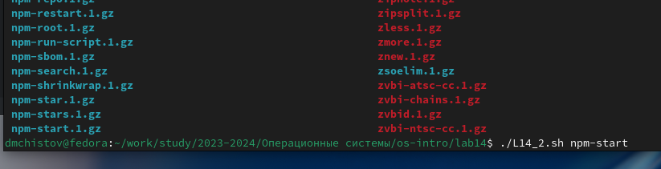

---
## Front matter
title: "Отчёт по лабораторной работе №14"
subtitle: "Операционные системы"
author: "Чистов Даниил Максимович"

## Generic otions
lang: ru-RU
toc-title: "Содержание"

## Bibliography
bibliography: bib/cite.bib
csl: pandoc/csl/gost-r-7-0-5-2008-numeric.csl

## Pdf output format
toc: true # Table of contents
toc-depth: 2
lof: true # List of figures
lot: false # List of tables
fontsize: 12pt
linestretch: 1.5
papersize: a4
documentclass: scrreprt
## I18n polyglossia
polyglossia-lang:
  name: russian
  options:
	- spelling=modern
	- babelshorthands=true
polyglossia-otherlangs:
  name: english
## I18n babel
babel-lang: russian
babel-otherlangs: english
## Fonts
mainfont: Liberation Serif
romanfont: Liberation Serif
sansfont: Liberation Serif
monofont: Liberation Serif
mainfontoptions: Ligatures=TeX
romanfontoptions: Ligatures=TeX
sansfontoptions: Ligatures=TeX,Scale=MatchLowercase
monofontoptions: Scale=MatchLowercase,Scale=0.9
## Biblatex
biblatex: true
biblio-style: "gost-numeric"
biblatexoptions:
  - parentracker=true
  - backend=biber
  - hyperref=auto
  - language=auto
  - autolang=other*
  - citestyle=gost-numeric
## Pandoc-crossref LaTeX customization
figureTitle: "Рис."
tableTitle: "Таблица"
listingTitle: "Листинг"
lofTitle: "Список иллюстраций"
lotTitle: "Список таблиц"
lolTitle: "Листинги"
## Misc options
indent: true
header-includes:
  - \usepackage{indentfirst}
  - \usepackage{float} # keep figures where there are in the text
  - \floatplacement{figure}{H} # keep figures where there are in the text
---

# Цель работы

Изучить основы программирования в оболочке ОС UNIX/Linux. Научиться писать небольшие командные файлы.

# Задания

1. Программа 1
2. Программа 2
3. Программа 3

# Выполнение лабораторной работы

# Программа 1

Задание: "Написать командный файл, реализующий упрощённый механизм семафоров. Командный файл должен в течение некоторого времени t1 дожидаться освобождения ресурса, выдавая об этом сообщение, а дождавшись его освобождения, использовать его в течение некоторого времени t2<>t1, также выдавая информацию о том, что ресурс используется соответствующим командным файлом (процессом). Запустить командный файл в одном виртуальном терминале в фоновом режиме, перенаправив его вывод в другой (> /dev/tty#, где # — номер терминала куда перенаправляется вывод), в котором также запущен этот файл, но не фоновом, а в привилегированном режиме. Доработать программу так, чтобы имелась возможность взаимодействия трёх и более процессов.

Приступаю к выполнению работы. Создаю файл с кодом и пишу код (сама программа будет показана позже), выполняю - готово (рис. [-@fig:001]), (рис. [-@fig:002]).

{#fig:001 width=70%}

{#fig:002 width=70%}

Код программы 1: cоздаём файл, и запускаем его. Бесконечно идём циклом while и проверяем утилитой flock, если программа используется, говорим об этом, ждём 5 секунд и освобождаем ресурс. Если не используется, то пишем, что ожидаем, и ждём 8 секунд. (рис. [-@fig:003]).

{#fig:003 width=70%}

# Программа 2

Задание: "Реализовать команду man с помощью командного файла. Изучите содержимое каталога /usr/share/man/man1. В нем находятся архивы текстовых файлов, содержащих справку по большинству установленных в системе программ и команд. Каждый архив можно открыть командой less сразу же просмотрев содержимое справки. Командный файл должен получать в виде аргумента командной строки название команды и в виде результата выдавать справку об этой команде или сообщение об отсутствии справки, если соответствующего файла нет в каталоге man1."

Приступаю к выполнению - создаю, даю права, пишу код, исправляю ошибки, запускаю - работает (рис. [-@fig:004]), (рис. [-@fig:005]).

{#fig:004 width=70%}

{#fig:005 width=70%}

Код программы 2: Создаю переменную (название команды, которую мы хотим изучить), утилитой test проверяем, есть ли документация по этой команде в заданой директории. Если есть, то читаем её утилитой less, если нету, пишем что такой документации нет (рис. [-@fig:006]).

{#fig:006 width=70%}

# Программа 3

Задание: "Используя встроенную переменную $RANDOM, напишите командный файл, генерирующий случайную последовательность букв латинского алфавита. Учтите, что $RANDOM выдаёт псевдослучайные числа в диапазоне от 0 до 32767."

Создаю файл, даю права, начинаю писать код, всё работает (рис. [-@fig:007]).

{#fig:007 width=70%}

Код программы 3: Создаю переменную - строку со всеми буквами латинского алафавита. Затем задаю ещё одну переменную "Длина строки" - утилитой $RANDOM выбираю случайное число. Это и будет длина. Задаю переменную результата - пустую строку. Циклом for иду столько число раз, сколько в перменной "длина" В каждой итерации - беру индекс - утилитой $RANDOM это будет случайное число до 26. Затем временной переменной letter достаю из строки из алфавита букву, которая находится по ранее найденному индексу. Приписываю эту букву к перменной результат. Вывожу (рис. [-@fig:008]).

{#fig:008 width=70%}

# Выводы

В результате выполненения данной работы я изучил основы программирования в оболочке ОС UNIX/Linux. Научился писать небольшие командные файлы.

# Список литературы{.unnumbered}

[Лабораторная работы №14](https://esystem.rudn.ru/pluginfile.php/2288101/mod_resource/content/4/012-lab_shell_prog_3.pdf)

[Работа с строками и shell scripting](https://www.geeksforgeeks.org/string-manipulation-in-shell-scripting/)

[Комнада flock](https://man7.org/linux/man-pages/man1/flock.1.html)

